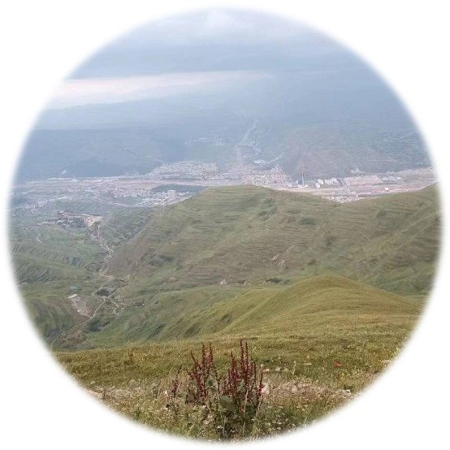

### 云安全
                         _                 _                                 _ _         
                        | |               | |                               (_) |        
                     ___| | ___  _   _  __| |______ ___  ___  ___ _   _ _ __ _| |_ _   _ 
                    / __| |/ _ \| | | |/ _` |______/ __|/ _ \/ __| | | | '__| | __| | | |
                    | (__| | (_) | |_| | (_| |      \__ \  __/ (__| |_| | |  | | |_| |_| |
                    \___|_|\___/ \__,_|\__,_|      |___/\___|\___|\__,_|_|  |_|\__|\__, |
                                                                                    __/ |
                                                                                   |___/ 
<br/>
  <p align="center">
    
    
    
    
    
    
</p>
<br/>
&nbsp;&nbsp;&nbsp;&nbsp;&nbsp;&nbsp;&nbsp;&nbsp; 国内关于k8s docker安全内容少之又少，关于靶场部分只是讲的很模糊，这里我和我的朋友们学习云安全文章的一些笔记，希望对各位师傅有一些帮助[还有很多东西还在编写中]
<br/><br/>


## 🚀上手指南
* [x] k8s靶场搭建
* [x] Sensitive keys in codebases [代码库中敏感信息]
* [x] DIND (docker-in-docker) exploitation [DIND （docker-in-docker） 漏洞利用]
* [x] SSRF in the Kubernetes (K8S) world [K8s中的ssrf]
* [x] Container escape to the host system [容器逃逸到主机系统]
* [x] Docker CIS benchmarks analysis [Docker CIS 基准测试分析--docker安全排查]
* [x] Kubernetes CIS benchmarks analysis [Kubernetes CIS 基准测试分析--k8s安全排查]
* [x] Attacking private registry [攻击docker私有注册表]
* [x] NodePort exposed services [NodePort 暴露的服务]
* [x] Analyzing crypto miner container 分析加密挖矿容器[将挖矿木马映像推送到公共容器注册表]
* [x] Kubernetes namespaces bypass [Kubernetes 命名空间绕过 内核路由表]
* [x] Gaining environment information [获取环境信息]
* [x] docker渗透基础知识 
* [x] docker---配置不当--特权模式
* [x] docker---配置不当--Socket逃逸
* [x] docker---逃逸成功之后操作---docker
* [x] 环境地址：https://pan.baidu.com/s/1h6nr8izEoRtcIhP27BcHuQ?pwd=ymi7 
* [x] 还在编写中


## :zap:提交问题
有问题建议请提交issues<br/>
<a href="https://github.com/RuoJi6/cloud-security/issues"></a>
<br/>
加我微信进开发者微信群聊 
<br/>
<br/>
<br/>

## :world_map:版本更新
```
2023/11/20
  k8s靶场搭建
  Sensitive keys in codebases
  DIND (docker-in-docker) exploitation
  SSRF in the Kubernetes (K8S) world
  Container escape to the host system
  k8s基础知识
--------------------------------------------------
2023/11/21
  Docker CIS benchmarks analysis [Docker CIS 基准测试分析--docker安全排查]
  Kubernetes CIS benchmarks analysis [Kubernetes CIS 基准测试分析--k8s安全排查]
  Attacking private registry [攻击docker私有注册表--k8s靶场]
  NodePort exposed services [NodePort 暴露的服务--k8s靶场]
--------------------------------------------------
2023/11/25
  Analyzing crypto miner container 分析加密挖矿容器[将挖矿木马映像推送到公共容器注册表--k8s安全排查]
  Kubernetes namespaces bypass [Kubernetes 命名空间绕过 内核路由表--k8s靶场]
--------------------------------------------------
2023/12/2
  Gaining environment information [获取环境信息]
  docker渗透基础知识 
  docker---配置不当--特权模式
  docker---配置不当--Socket逃逸
  docker---逃逸成功之后操作---docker
```

<br/>

## 感谢以下为 项目贡献的师傅们 :confetti_ball:
<table>
    <tr>
        <td align="center"><br />弱鸡</td>
        <td align="center"><br />FH_hone</td>
        <td align="center"><br />forerunner-凝</td>
        <td align="center"><br />T4x0r</td>
        <td align="center"><br />杭椒</td>
        <td align="center"><br />zhihuijiazeng</td>
        <td align="center"><br />不懂安全的开发</td>
    </tr>
</table>


## :clap:致谢
https://madhuakula.com/kubernetes-goat/docs/<br/>
https://github.com/madhuakula/kubernetes-goat<br/>
https://cloud.hacktricks.xyz/<br/>
感谢以上博客以及github，让我受益良多[以上排名不分先后]
<br/><br/>

## 🚨扫码添加 回复  弱鸡交流群


## :star2:Stargazers over time  [](https://star-history.com/#RuoJi6/cloud-security&Date)

## Stargazers

[](https://github.com/RuoJi6/cloud-security/stargazers)


## Forkers

[](https://github.com/RuoJi6/cloud-security/network/members)


<br/><br/>

<a href="https://github.com/RuoJi6">
  
</a>
<a href="https://github.com/RuoJi6/cloud-security/">
  
</a>


