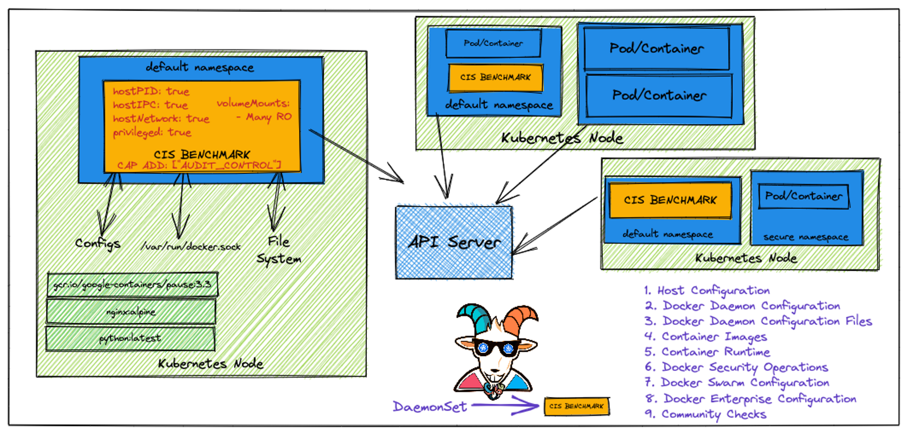
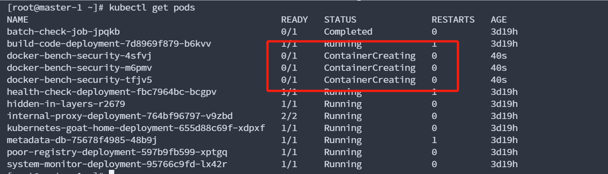
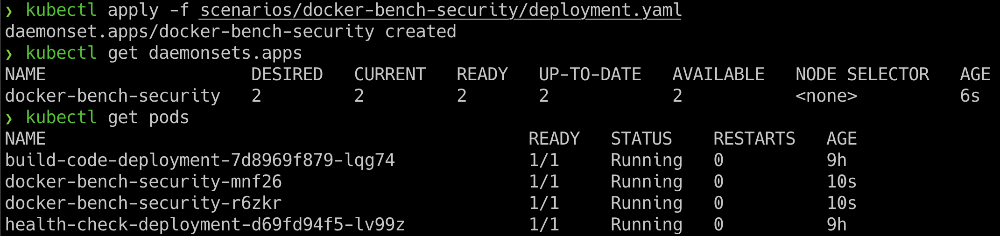
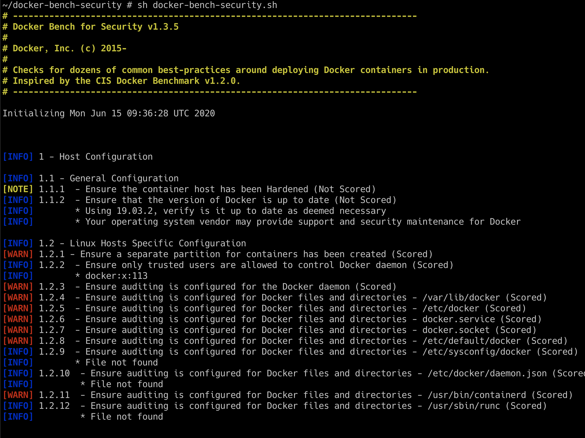

Docker CIS benchmarks analysis

Docker CIS 基准测试分析



 

Docker CIS 基准是由 Center for Internet Security（CIS）组织发布的一系列 Docker 容器平台的安全最佳实践和配置建议。CIS Docker 基准旨在提供一个框架，帮助组织确保其 Docker 容器环境的安全性，并减少受到各种安全威胁的风险。

 

该基准包含一系列安全建议，涵盖了多个方面，包括容器主机、Docker 守护进程、容器镜像和容器运行时等。这些建议涉及到诸如身份验证、授权、监视、日志记录等方面的安全最佳实践。通过遵循这些建议，组织可以提高其 Docker 容器环境的安全性，减少受到潜在威胁的风险。

 

CIS Docker 基准是一个开放的社区项目，旨在与社区合作不断改进，并确保适应不断变化的威胁环境。这个基准的目标是为组织提供一个可操作的框架，帮助它们加固其 Docker 容器环境，使其更加安全可靠。组织可以通过遵循这些基准来审查其 Docker 容器环境的安全性，并采取必要的措施来纠正潜在的安全风险。

项目地址：https://github.com/docker/docker-bench-security

这个靶场主要是检查当前docker是否安全

部署一个节点

kubectl apply -f /root/kubernetes-goat/scenarios/docker-bench-security/deployment.yaml

 

\[这里我不知道为什么，我的运行之后一直在ContainerCreating，以下用官方截图\]



然后，我们可以通过运行以下命令从 DaemonSet 中列出正在运行的 pod

kubectl get pods



进入shell命令行

通过运行以下命令访问 poddocker-bench-security-xxxxx

kubectl exec -it docker-bench-security-xxxxx -- sh

docker-bench-security 已安装使用

​	docker-bench-security 已安装在容器内，您可以导航到相应的目录以执行扫描

cd docker-bench-security

 

项目地址：https://github.com/docker/docker-bench-security

拉取：git clone <https://github.com/docker/docker-bench-security.git>

如果存在，就不需执行下面步骤

​	kubectl cp /本地路径/文件.txt \<namespace\>/\<pod名称\>:\<容器路径\>/文件.txt

​		其中：

​			/本地路径/文件.txt 是本地文件的路径。

​			<namespace\> 是Pod所在的命名空间。

​			\<pod名称\> 是Pod的名称。

​			<容器路径\> 是容器内部的路径。

​	查看命名空间 kubectl get pod {pod名字} -o=jsonpath='{.metadata.namespace}'0

```shell
kubectl cp /root/docker-bench-security-master.zip default/build-code-deployment-7d8969f879-b6kvv:/app/docker-bench-security-master.zip
```

​		解压文件

​		unzip docker-bench-security-master.zip

我们可以运行以下命令来启动Docker CIS基准测试脚本进行审计

sh docker-bench-security.sh



 

 

 
