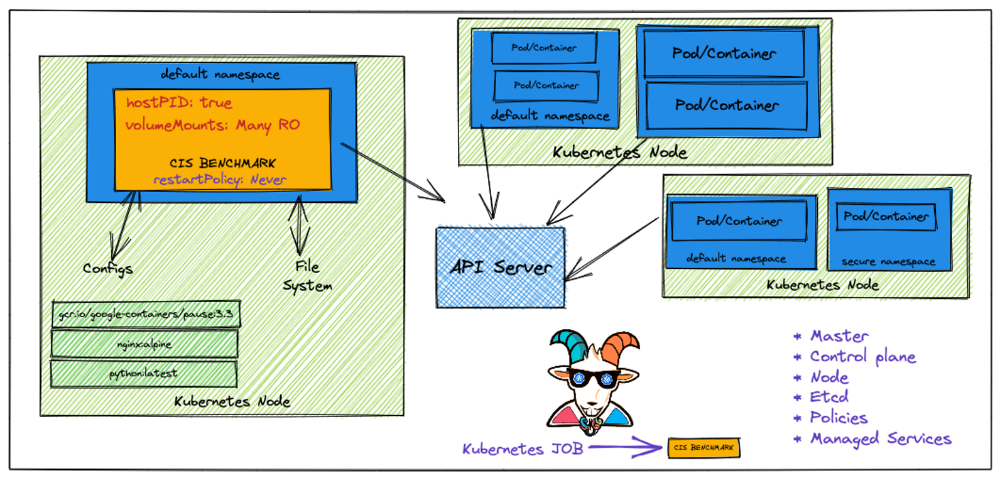
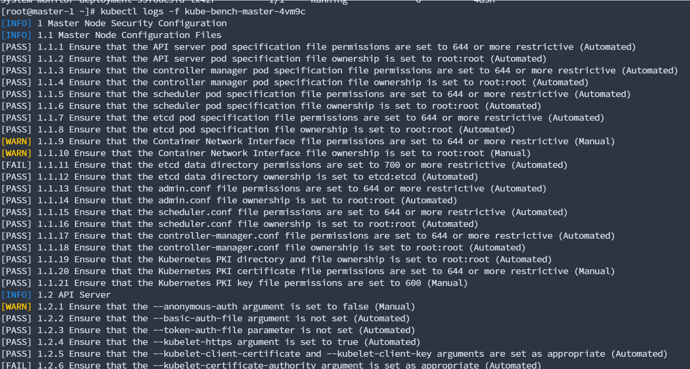

Kubernetes CIS benchmarks analysis

Kubernetes CIS 基准测试分析

 

此方案在执行 Kubernetes 安全审计和评估时非常有用。在这里，我们将学习如何对 Kubernetes 集群运行流行的 CIS 基准审计，并使用结果进一步利用或修复错误配置和漏洞。如果您来自容器、Kubernetes 和云原生生态系统的现代世界的审计和合规性背景，这一点非常重要，并且非常必要。

 

kubectl apply -f /root/kubernetes-goat/scenarios/kube-bench-security/node-job.yaml

kubectl apply -f/root/kubernetes-goat/scenarios/kube-bench-security/master-job.yaml

运行审计

kubectl logs -f kube-bench-node-xxxxx

 
