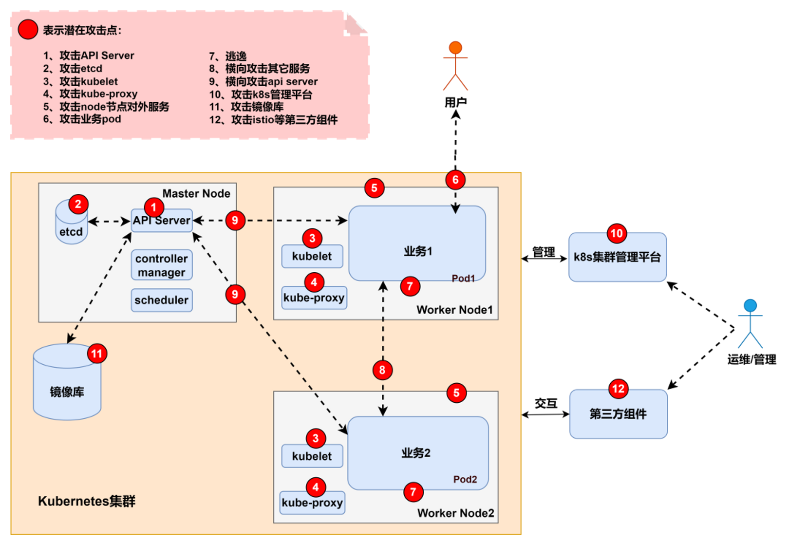
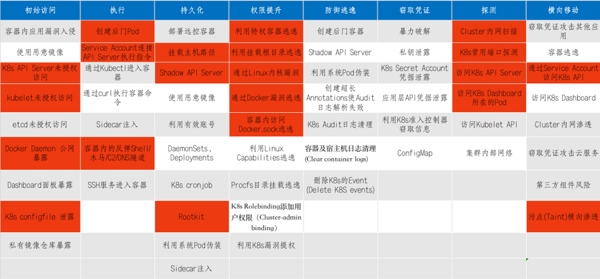
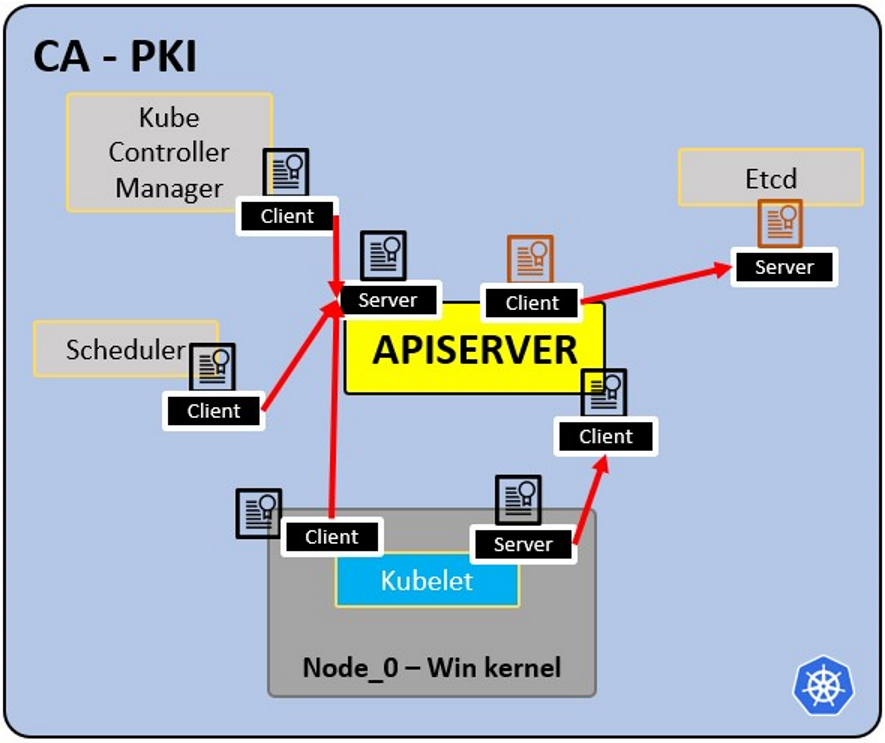
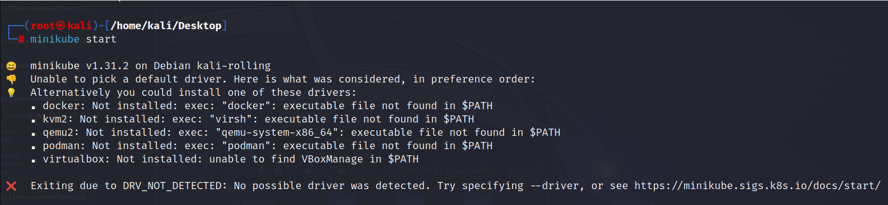
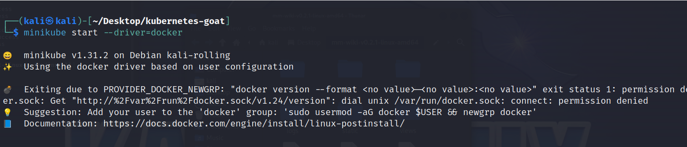
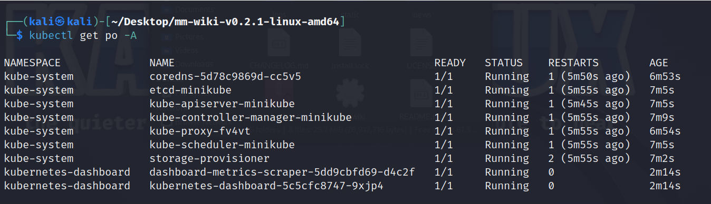
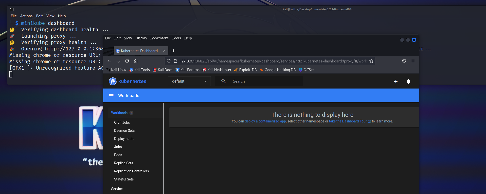

Kubernetes 基础知识

 **Kubernetes 是做什么的？**

- 允许在容器引擎中运行容器。

- 时间安排允许集装箱高效执行任务。

- 让容器保持活力。

- 允许容器通信。

- 允许部署技术。

- 处理大量信息。

就是用来快速，便捷，处理docker，使其多个容器在同一网段

 

  

 

 

 

 

 

  **主人\[Master\]**：控制，修改其它node机器里面的pod\[相当于是控制机器\]

 **节点\[node\]**：带有 pod 或 pods 的操作系统。

- **Pod**：一个容器或多个容器的包装器。一个 pod 只应包含一个应用程序（因此，通常一个 pod 只运行一个容器）。pod 是 kubernetes 对运行的容器技术进行抽象的方式。

  - **服务**：每个 pod 都有一个 来自节点内部范围 的内部**IP 地址**。 不过，它也可以通过一个服务公开。该 **服务也有一个 IP 地址** ，其目的是保持 pod 之间的通信，因此如果其中一个 pod 死掉， **新的替代**pod （具有不同的内部 IP） **将可以** 通过 **该服务的相同 IP**进行**访问**。它可以配置为内部或外部\[内网ip与出口外网ip\]。 **当 2 个 pod 连接** 到同一个服务 时，该服务还将充当 **负载平衡器** 。 **服务创建** 后 ， 您可以运行 kubectl get endpoints 查找每个服务的端点

  

 **Kubelet**：主节点代理。在节点和 kubectl 之间建立通信的组件，只能运行 pod（通过 API 服务器）。Kubelet 不管理不是由 Kubernetes 创建的容器。

 **Kube-proxy**：是负责 apiserver 和节点之间通信（服务）的服务。其基础是节点的 IPtables。经验丰富的用户可以安装其他供应商的 Kube-proxy。

 **Sidecar 容器**：Sidecar 容器是与 pod 中的主容器一起运行的容器。这种 Sidecar 模式可以在不改变现有容器的情况下扩展和增强其功能。如今，我们知道，我们使用容器技术来封装应用程序的所有依赖项，使其可以在任何地方运行。容器只做一件事，而且做得非常好。\[它允许将一个或多个附加容器（Sidecar 容器）与主应用程序容器一起部署在同一个 Pod 中\]

  

 **主流程：**

- **Api 服务器：** 这是用户和 pod 与主进程通信的方式。只允许经过验证的请求。

- **调度程序**：调度指的是确保 Pod 与节点匹配，以便 Kubelet 可以运行它们。它有足够的智能来决定哪个节点有更多可用资源，并将新 pod 分配给它。请注意，调度程序不会启动新 pod，它只是与节点内运行的 Kubelet 进程通信，后者将启动新 pod。

- **Kube 控制器管理器**：它检查复制集或部署等资源，例如检查 pod 或节点的运行数量是否正确。如果缺少 pod，它会与调度程序通信，以启动一个新的 pod。它控制复制、令牌和 API 的账户服务。

- **etcd**：数据存储，持久、一致、分布式。etcd是Kubernetes的数据库和键值存储，它保存了集群的完整状态（每次变化都记录在这里）。调度器或控制器管理器等组件都要依靠这个日期来了解发生了哪些变化（节点的可用资源、运行的 pod 数量......）。\[高度可靠的分布式键值存储系统，用于在分布式应用程序中存储配置数据、元数据和状态信息\]

  

 请注意，由于可能有多个节点\[node\]（运行多个 pod），因此也可能有多个主进程，它们对 Api 服务器的访问是负载均衡的，其 etcd 也是同步的。

  

 卷：

 当 pod 创建的数据在 pod 消失时不应丢失，这些数据应存储在物理卷中。 **Kubernetes 允许将卷附加到 pod 上以持久化数据**。卷可以在本地机器中，也可以 在**远程存储**中。如果在不同的物理节点上运行 pod，则应使用远程存储，这样所有 pod 都能访问它。

  

 **其他配置：**

- **配置地图**：您可以配置 访问服务的**URL**。 pod 将从这里获取数据，以便知道如何与其他服务（pod）通信。请注意，这里不是保存凭据的推荐位置！

- **Secret**：此处用于 **存储** 密码、API 密钥......等以 B64 编码的**秘密数据** 。pod 可以访问这些数据，以使用所需的凭证。

- **部署**：这里指明了 kubernetes 要运行的组件。用户通常不会直接使用 pod，而是将 pod 抽象 到**ReplicaSets** （ **复制** 相同 pod 的数量） 中 ，通过部署来运行。请注意，部署适用于 **无状态** 应用程序。部署的最低配置是名称和要运行的映像。\[就是写成yaml文件\]

- **StatefulSet**：该组件专门用于 需要 **访问相同存储**的**数据库**等应用程序 。


- **入口\[**Ingress**\]**：这是使用 **URL 公开发布应用程序**的配置 。请注意，这也可以通过外部服务完成，但这才是公开应用程序的正确方式。

  - Ingress 是 Kubernetes 中的一种资源对象，用于管理和暴露集群内的服务到集群外部。Ingress 允许您定义应用程序的 HTTP 和 HTTPS 路由规则，以便外部用户可以访问应用程序，并将流量路由到不同的服务或服务的版本。它是一种用于配置应用程序入口的抽象，通常与**反向代理或负载均衡器一起使用**。\[就是用来处理k8s http和 https路由规则\]

  - Ingress 资源是 Kubernetes 中的一种 **API 对象**，用于定义 HTTP 和 HTTPS 路由规则，以便将流量从集群外部路由到集群内的服务。Ingress 允许您配置如何处理外部请求，并将其路由到不同的后端服务或服务的版本。它提供了一种集中管理和配置应用程序入口的方式，而不需要更改服务代码。

  &nbsp;

  - 如果实施入口，则需要创建 **入口控制器**。 Ingress Controller 是一个 **pod**， 将作为接收请求和检查 **的** 端点，并将它们负载平衡到服务 。请注意，入口规则可以指向不同的路径，甚至指向不同 kubernetes 内部服务的子域。

    - 更好的安全做法是使用云负载平衡器或代理服务器作为入口点，不暴露 Kubernetes 集群的任何部分。

    - 当收到不符合任何入口规则的请求时，入口控制器会将其导向 "**默认后端**"。您可以 通过描述 入口控制器来获取该参数的地址。

    - minikube 附加组件启用 ingress

  

  

 **PKI 基础设施 - 证书颁发机构 CA：**

 

  

- CA 是群集内所有证书的受信根。

- 允许组件之间相互验证。

- 所有集群证书都由 CA 签名。

- ETCd 有自己的证书。

- 类型

  - apiserver 证书。

  - kubelet 证书。

  - 调度员证书

  

  

 **基本使用**

 **Minikube**

 **Minikube** 可 用于 在 kubernetes 上 执行一些 **快速测试**， 而无需部署整个 kubernetes 环境。它将 **在一台机器**上 运行 **主进程和节点进程**。Minikube 将使用 virtualbox 运行节点。请参见 [**此处了解如何安装**](https://minikube.sigs.k8s.io/docs/start/)。\[我使用的是kali 2023.1，而且需要安装好docker\]

 

  

- 下面启动出现这个报错，请安装docker，然后执行

 minikube start --driver=docker

 

 要使 docker 成为默认驱动程序，请执行以下操作：

 minikube config setdriver docker

 

 

 下面报错，执行这个切换到普通用户执行

 sudo usermod -aG docker \$USER && newgrp docker

 在执行\[这里需要下载一些资源\]

 minikube start --driver=docker

 

 

 查看运行状态

 minikube status

 

 

 安装kubectl

 sudo apt install kubernetes-client or minikube kubectl -- get po -A \[[使用minikube启动kubectl](https://minikube.sigs.k8s.io/docs/start/#:~:text=Alternatively%2C%20minikube%20can%20download%20the%20appropriate%20version%20of%20kubectl%20and%20you%20should%20be%20able%20to%20use%20it%20like) \]

 查看minikube载入的pod kubectl get po -A

 

 

 

 **Kubectl 基础知识**

 **Kubectl** 是用于 kubernetes 集群的命令行工具。它与主进程的 Api 服务器通信，以执行 ubernetes 中的操作或请求数据。

 ```yaml
 kubectl version # 获取客户端和服务器版本信息
 kubectl get pod # 获取 Pods 列表
 kubectl get services # 获取服务列表
 kubectl get deployment # 获取部署列表
 kubectl get replicaset # 获取 ReplicaSet 列表
 kubectl get secret # 获取 Secrets 列表
 kubectl get all # 获取所有资源列表
 kubectl get ingress # 获取 Ingress 列表
 kubectl get endpoints # 获取端点列表
 
 # 创建一个部署
 kubectl create deployment nginx-deployment --image=nginx
 # 访问部署的配置并进行修改
 kubectl edit deployment nginx-deployment
 # 获取 Pod 的日志，用于调试（显示容器运行的输出）
 kubectl logs nginx-deployment-84cd76b964
 # 获取 Pod 的详细信息
 kubectl describe pod mongo-depl-5fd6b7d4b4-kkt9q
 # 在 Pod 中执行命令（例如，进入 Pod 的终端）
 kubectl exec -it mongo-depl-5fd6b7d4b4-kkt9q -- bash
 # 获取服务的详细信息
 kubectl describe service mongodb-service
 # 删除一个部署
 kubectl delete deployment mongo-depl
 # 使用配置文件部署
 kubectl apply -f deployment.yml
 ```

 **Minikube** **控制面板**

 通过仪表板，您可以更轻松地查看 minikube 的运行情况，并找到访问它的 URL：

 ​	启动 Kubernetes 仪表板

 ​		minikube dashboard

 

 **YAML** **配置文件示例**

 每个配置文件都有 3 个部分： **元数据**、 **规范** （需要启动的内容）、 **状态** （希望的状态）。 在部署配置文件的规范中，你可以找到定义了新配置结构的模板，该结构定义了要运行的映像：


 **在同一配置文件中声明部署** **+** **服务的示例（**[**此处**](https://gitlab.com/nanuchi/youtube-tutorial-series/-/blob/master/demo-kubernetes-components/mongo.yaml)**来自 ）**

 由于一个服务通常与一个部署相关，因此可以在同一个配置文件中声明这两个服务（在此配置中声明的服务只能在内部访问）：

 ```yaml
 		apiVersion: apps/v1
 		kind: Deployment
 		metadata:
 		  name: mongodb-deployment
 		  labels:
 		    app: mongodb
 		spec:
 		  replicas: 1
 		  selector:
 		    matchLabels:
 		      app: mongodb
 		  template:
		    metadata:
		      labels:
 		        app: mongodb
 		    spec:
 		      containers:
 		      - name: mongodb
		        image: mongo
 		        ports:
 		        - containerPort: 27017
 		        env:
		        - name: MONGO_INITDB_ROOT_USERNAME
 		          valueFrom:
 		            secretKeyRef:
 		              name: mongodb-secret
 		              key: mongo-root-username
 		        - name: MONGO_INITDB_ROOT_PASSWORD
 		          valueFrom: 
 		            secretKeyRef:
 		              name: mongodb-secret
 		              key: mongo-root-password
 		---
 		apiVersion: v1
 		kind: Service
 		metadata:
 		  name: mongodb-service
 		spec:
 		  selector:
 		    app: mongodb
 		  ports:
 		    - protocol: TCP
 		      port: 27017
       targetPort: 27017
 ```

 **外部服务配置示例**

 此服务将可以从外部访问（请检查nodePort和type: LoadBalancer属性）

 ```yaml
 		---
 		apiVersion: v1
 		kind: Service
 		metadata:
 		name: mongo-express-service
 		spec:
 		selector:
 		app: mongo-express
 		type: LoadBalancer
 		ports:
 		- protocol: TCP
 		port: 8081
 		targetPort: 8081
 		nodePort: 30000
 ```

 这对于测试很有用，但对于生产环境，您应该只有内部服务和一个Ingress来暴露应用程序。

 **Ingress配置文件示例** [Ingress是一种API对象，用于管理外部访问到集群内服务的规则。它充当了集群中服务的入口点，并允许外部流量通过定义的规则路由到相应的服务。Ingress资源通常用于HTTP和HTTPS流量的路由，但也可以配置其他协议的规则。]

 这将在http://dashboard.com中暴露应用程序。

 ```yaml
 	apiVersion: networking.k8s.io/v1
 	kind: Ingress
 	metadata:
 	name: dashboard-ingress
 	namespace: kubernetes-dashboard
 	spec:
 	rules:
 	- host: dashboard.com
 	http:
 	paths:
 	- backend:
 	serviceName: kubernetes-dashboard
 	servicePort: 80
 ```

**秘密配置文件示例**

请注意密码是以B64编码的（这并不安全！）[Secrets（秘密）资源是用于存储和管理敏感信息的一种方式。Secrets可以被挂载到Pod中，从而使Pod可以访问其中存储的敏感信息。这有助于隔离敏感信息，同时确保在Kubernetes中进行应用程序部署时能够方便地管理这些信息。]

apiVersion: v1

kind: Secret

metadata:

name: mongodb-secret

type: Opaque

data:

mongo-root-username: dXNlcm5hbWU=

mongo-root-password: cGFzc3dvcmQ=

**ConfigMap****示例**

一个**ConfigMap**是提供给Pod的配置，以便它们知道如何定位和访问其他服务。在这种情况下，每个Pod将知道mongodb-service是一个可以与之通信的Pod的地址（该Pod将执行一个mongodb）：

apiVersion: v1

kind: ConfigMap

metadata:

name: mongodb-configmap

data:

database_url: mongodb-service

然后，在**部署配置**中，可以通过以下方式指定该地址，以便在Pod的环境中加载：

[...]

spec:

[...]

template:

[...]

spec:

containers:

\- name: mongo-express

image: mongo-express

ports:

\- containerPort: 8081

env:

\- name: ME_CONFIG_MONGODB_SERVER

valueFrom:

configMapKeyRef:

name: mongodb-configmap

key: database_url

[...]

**卷配置示例**

您可以在 https://gitlab.com/nanuchi/youtube-tutorial-series/-/tree/master/kubernetes-volumes中找到不同的存储配置yaml文件的示例。 

**请注意，卷不在命名空间内**


**命名空间**

Kubernetes支持由同一物理集群支持的**多个虚拟集群**。这些虚拟集群称为**命名空间**。这些命名空间适用于在多个团队或项目中分散的许多用户的环境中使用。对于具有几个到几十个用户的集群，您不需要创建或考虑命名空间。您只需要开始使用命名空间来更好地控制和组织在Kubernetes中部署的应用程序的每个部分。【物理集群通常指的是由多个节点组成的一个整体。】

 

命名空间为名称提供了范围。资源的名称在命名空间内需要是唯一的，但在命名空间之间不需要唯一。命名空间不能嵌套在彼此内部，**每个**Kubernetes**资源**只能**在一个**命名空间中。

 

如果您使用minikube，默认情况下有4个命名空间：

 

kubectl get namespace

NAME          STATUS  AGE

default          Active  1d

kube-node-lease  Active  1d

kube-public      Active  1d

kube-system     Active   1d

- **kube-system**: 这个命名空间不是为用户使用的，你不应该触碰它。它是用于主节点和kubectl进程的。
- **kube-public**: 公开可访问的数据。包含一个配置映射，其中包含集群信息。
- **kube-node-lease**: 确定节点的可用性。
- **default**: 用户将用来创建资源的命名空间。

 

\#创建命名空间

kubectl create namespace my-namespace

 

请注意，大多数Kubernetes资源（例如pod、service、replication controller等）都属于某个命名空间。但是，其他资源，如命名空间资源和低级资源（例如节点和持久卷）不属于任何命名空间。要查看哪些Kubernetes资源属于命名空间，哪些不属于命名空间：

kubectl api-resources --namespaced=true #在命名空间中

kubectl api-resources --namespaced=false #不在命名空间内

 

您可以在该上下文中为所有后续的kubectl命令保存命名空间。

kubectl config set-context --current --namespace=<insert-namespace-name-here

 

**Helm**

Helm是Kubernetes的**包管理器**。它允许将YAML文件打包并分发到公共和私有仓库中。这些包被称为**Helm Charts**。

helm search <keyword>

Helm也是一个模板引擎，允许使用变量生成配置文件：

 

 

**Kubernetes secrets**

**Secret**是一个包含敏感数据（如密码、令牌或密钥）的对象。这些信息可能会放在Pod规范或镜像中。用户可以创建Secrets，系统也会创建Secrets。Secret对象的名称必须是一个有效的DNS子域名。在这里阅读[官方文档](https://kubernetes.io/docs/concepts/configuration/secret/)。

Secrets可以是以下内容：

- API、SSH密钥。
- OAuth令牌。
- 凭据、密码（明文或b64 +加密）。
- 信息或注释。
- 数据库连接代码、字符串...。

Kubernetes中有不同类型的secrets

| **内置类型**                        | **用途**                          |
| ----------------------------------- | --------------------------------- |
| **Opaque**                          | **任意用户定义的数据（默认）**    |
| kubernetes.io/service-account-token | 服务帐户令牌                      |
| kubernetes.io/dockercfg             | 序列化的~/.dockercfg文件          |
| kubernetes.io/dockerconfigjson      | 序列化的~/.docker/config.json文件 |
| kubernetes.io/basic-auth            | 基本身份验证凭据                  |
| kubernetes.io/ssh-auth              | SSH身份验证凭据                   |
| kubernetes.io/tls                   | 用于TLS客户端或服务器的数据       |
| bootstrap.kubernetes.io/token       | 引导令牌数据                      |

​     Opaque类型是默认类型，由用户定义的典型键值对。

**Secrets****的工作原理：**


 

以下配置文件定义了一个名为mysecret的**secret**，其中包含2个键值对username: YWRtaW4=和password: MWYyZDFlMmU2N2Rm。它还定义了一个名为secretpod的**pod**，该pod将在**环境变量**SECRET_USERNAME和SECRET_PASSWORD中公开mysecret中定义的username和password。它还将以0640权限将username secret挂载到路径/etc/foo/my-group/my-username中。

```yaml
secretpod.yaml
	apiVersion: v1
	kind: Secret
	metadata:
	name: mysecret
	type: Opaque
	data:
	username: YWRtaW4=
	password: MWYyZDFlMmU2N2Rm
	---
	apiVersion: v1
	kind: Pod
	metadata:
	name: secretpod
	spec:
	containers:
	- name: secretpod
	image: nginx
	env:
	- name: SECRET_USERNAME
	valueFrom:
	secretKeyRef:
	name: mysecret
	key: username
	- name: SECRET_PASSWORD
	valueFrom:
	secretKeyRef:
	name: mysecret
	key: password
	volumeMounts:
	- name: foo
	mountPath: "/etc/foo"
	restartPolicy: Never
	volumes:
	- name: foo
	secret:
	secretName: mysecret
	items:
	- key: username
	path: my-group/my-username
	mode: 0640
	
	kubectl apply -f <secretpod.yaml
	kubectl get pods #Wait until the pod secretpod is running
	kubectl exec -it  secretpod -- bash
	env | grep SECRET && cat /etc/foo/my-group/my-username && echo
```

 

**在** **etcd** **中发现秘密**

**etcd** 是一个一致且高可用的**键值存储**，用作 Kubernetes 的后备存储，用于存储集群数据。让我们访问存储在 etcd 中的秘密：

 

```shell
cat /etc/kubernetes/manifests/kube-apiserver.yaml | grep etcd
```

 

你会看到证书、密钥和URL的位置在文件系统中。一旦获取到它们，你就能够连接到etcd。

 

 

```shell
ETCDCTL_API=3 etcdctl --cert /etc/kubernetes/pki/apiserver-etcd-client.crt --key /etc/kubernetes/pki/apiserver-etcd-client.key --cacert /etc/kubernetes/pki/etcd/etcd/ca.cert endpoint=[127.0.0.1:1234] health
```

 

一旦建立通信，您将能够获取秘密：

 

```shell
#ETCDCTL_API=3 etcdctl --cert <path to client.crt> --key <path to client.ket> --cacert <path to CA.cert> endpoint=[<ip:port>] get <path/to/secret>
```

 

```shell
ETCDCTL_API=3 etcdctl --cert /etc/kubernetes/pki/apiserver-etcd-client.crt --key /etc/kubernetes/pki/apiserver-etcd-client.key --cacert /etc/kubernetes/pki/etcd/etcd/ca.cert endpoint=[127.0.0.1:1234] get /registry/secrets/default/secret_02
```

 

**为****ETCD****添加加密**

默认情况下，除非应用加密层，否则所有的密钥都以明文形式存储在etcd中。以下示例基于 https://kubernetes.io/docs/tasks/administer-cluster/encrypt-data/

 

```yaml
	apiVersion: apiserver.config.k8s.io/v1
	kind: EncryptionConfiguration
	resources:
	- resources:
	- secrets
	providers:
	- aescbc:
	keys:
	- name: key1
	secret: cjjPMcWpTPKhAdieVtd+KhG4NN+N6e3NmBPMXJvbfrY= #Any random key
- identity: {}
```

 

之后，您需要在 kube-apiserver 上设置 --encryption-provider-config 标志，指向创建的配置文件的位置。您可以修改 /etc/kubernetes/manifest/kube-apiserver.yaml 文件，并添加以下行：

```yaml
	containers:
	- command:
	- kube-apiserver
- --encriyption-provider-config=/etc/kubernetes/etcd/<configFile.yaml>
```

 

向下滚动到volumeMounts部分：

```yaml
	- mountPath: /etc/kubernetes/etcd
	name: etcd
	readOnly: true

```


在volumeMounts中向下滚动到hostPath:

```yaml
	- hostPath:
	path: /etc/kubernetes/etcd
	type: DirectoryOrCreate
name: etcd
```

 

**验证数据是否加密**

数据在写入etcd时会被加密。在重新启动kube-apiserver之后，任何新创建或更新的密钥都应该在存储时被加密。为了检查，您可以使用etcdctl命令行程序来检索密钥的内容。

 

1. 在default命名空间中创建一个名为secret1的新密钥：

kubectl create secret generic secret1 -n default --from-literal=mykey=mydata

1. 使用etcdctl命令行从etcd中读取该密钥：

ETCDCTL_API=3 etcdctl get /registry/secrets/default/secret1 [...] | hexdump -C

 

其中[...]必须是连接到etcd服务器的附加参数。 3. 验证存储的密钥是否以k8s:enc:aescbc:v1:为前缀，这表示aescbc提供程序已加密生成的数据。 4. 通过API检索密钥时，验证密钥是否被正确解密：

kubectl describe secret secret1 -n default

 

应该与mykey: bXlkYXRh匹配，其中mydata是编码的，请参阅解码密钥以完全解码密钥。

密生成的数据。 4. 通过API检索密钥时，验证密钥是否被正确解密：

kubectl get secrets --all-namespaces -o json | kubectl replace -f -
