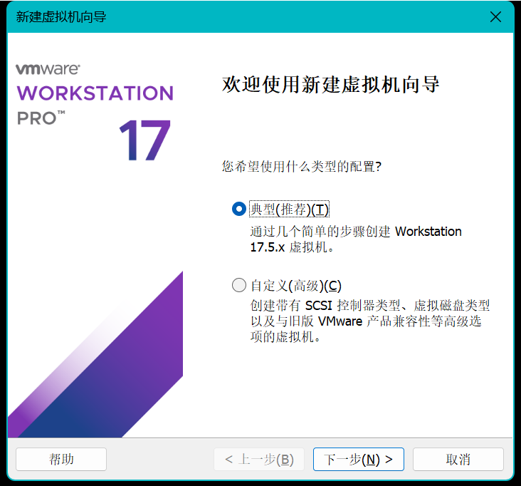
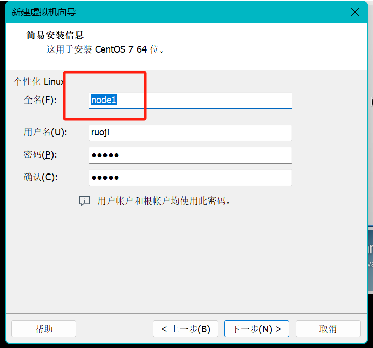
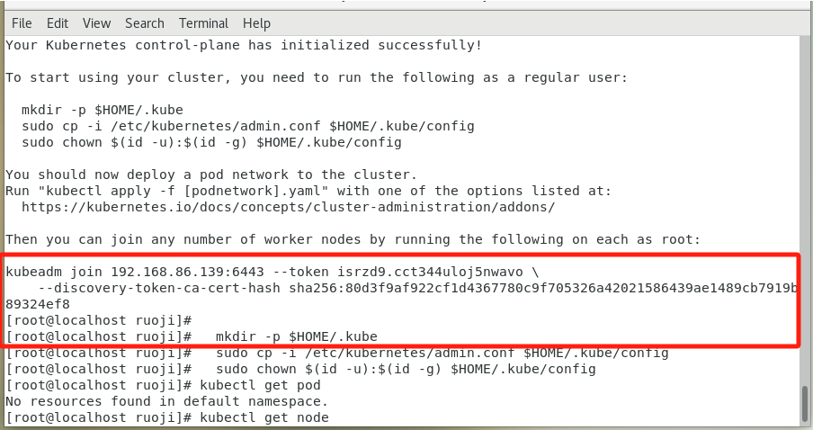
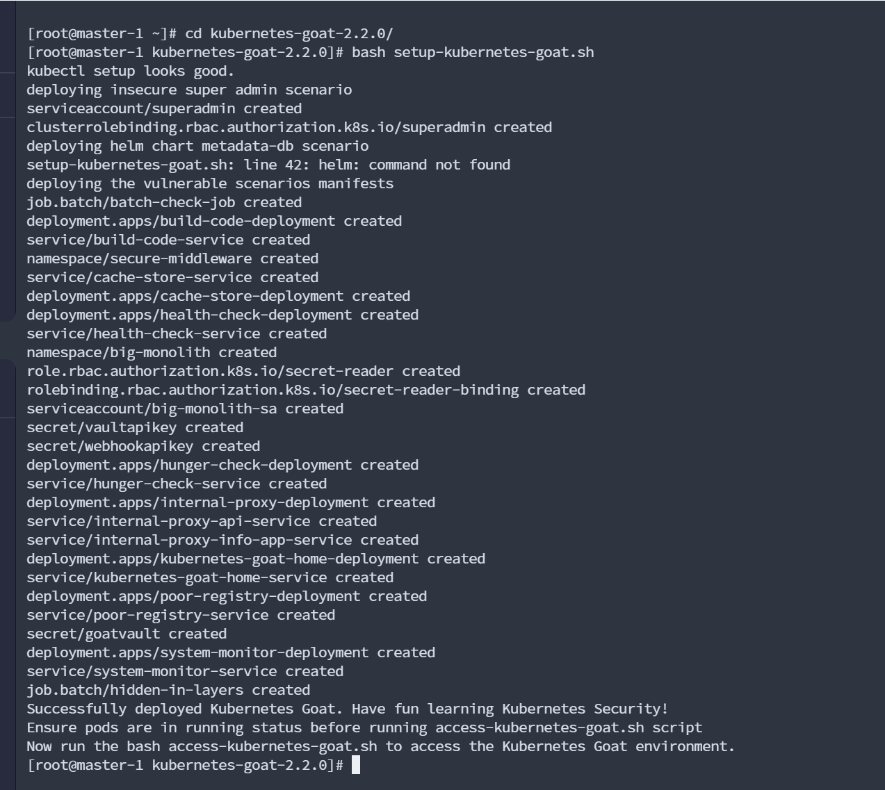

Kubernetes Goat靶场搭建

**1、CentOS-7-x86_64-DVD-2009镜像搭建k8s**

直接下一步即可\[其它三个一样，只是名字不一样master/node1/node2/node3\]

四台机器

修改机器内存大小以及CPU，电脑配置不好，开三台即可master node1 node2

**2、记录Ip地址\[以下所有操作请切换成root用户 su root\]（所有机器）**

master 192.168.86.139

node1 192.168.86.140

node2 192.168.86.141

node3 192.168.86.143

 

 

同时修改主机名

hostnamectl set-hostname master-1

hostnamectl set-hostname node1

hostnamectl set-hostname node2

hostnamectl set-hostname node3

查看主机名

hostnamectl status

 

**3、修改 hosts\[master/node1/node2/node3\]：（所有机器）**

cat \<\<EOF \>\>/etc/hosts

192.168.86.139 master-1

192.168.86.140 node1

192.168.86.141 node2

192.168.86.143 node3

EOF

 

 

\# 安装docker所需的工具

yum install -y yum-utils device-mapper-persistent-data lvm2

\# 配置阿里云的docker源

yum-config-manager --add-repo <http://mirrors.aliyun.com/docker-ce/linux/centos/docker-ce.repo>

\# 指定安装这个版本的docker-ce

yum install -y docker-ce-18.09.9-3.el7

\# 启动docker

systemctl enable docker && systemctl start docker

 

**4、配置环境（所有机器）**

> \# 关闭防火墙
>
> systemctl disable firewalld
>
> systemctl stop firewalld
>
>  
>
> \# 关闭selinux
>
> \# 临时禁用selinux
>
> setenforce 0
>
>  
>
> \# 永久关闭 修改/etc/sysconfig/selinux文件设置
>
> sed -i 's/SELINUX=permissive/SELINUX=disabled/' /etc/sysconfig/selinux
>
> sed -i "s/SELINUX=enforcing/SELINUX=disabled/g" /etc/selinux/config
>
>  
>
> \# 禁用交换分区
>
> swapoff -a
>
>  
>
> \# 永久禁用，打开/etc/fstab注释掉swap那一行。
>
> sed -i 's/.\*swap.\*/#&/' /etc/fstab
>
>  
>
> \# 修改内核参数
>
> cat \<\<EOF \> /etc/sysctl.d/k8s.conf
>
> net.bridge.bridge-nf-call-ip6tables = 1
>
> net.bridge.bridge-nf-call-iptables = 1
>
> EOF
>
>  
>
> sysctl --system
>
>  

**5、 安装kubeadm、kubelet、kubectl（所有机器）**

> \# 执行配置k8s阿里云源
>
> cat \<\<EOF \> /etc/yum.repos.d/kubernetes.repo
>
> \[kubernetes\]
>
> name=Kubernetes
>
> baseurl=https://mirrors.aliyun.com/kubernetes/yum/repos/kubernetes-el7-x86_64/
>
> enabled=1
>
> gpgcheck=1
>
> repo_gpgcheck=1
>
> gpgkey=https://mirrors.aliyun.com/kubernetes/yum/doc/yum-key.gpg <https://mirrors.aliyun.com/kubernetes/yum/doc/rpm-package-key.gpg>
>
> EOF
>
>  
>
> \# 安装kubeadm、kubectl、kubelet
>
> yum install -y kubectl-1.16.0-0 kubeadm-1.16.0-0 kubelet-1.16.0-0
>
>  
>
> \# 启动kubelet服务
>
> systemctl enable kubelet && systemctl start kubelet
>
>  

**6、 安装k8s v1.16.0 master管理节点**

> 在master执行 **192.168.86.139**master ip地址\[需要修改ip地址\]**（master机器）**
>
> kubeadm init --image-repository registry.aliyuncs.com/google_containers --kubernetes-version v1.16.0 --apiserver-advertise-address **192.168.86.139** --pod-network-cidr=10.244.0.0/16 --token-ttl 0
>
> 
>
> 然后在执行打红框的命令**（master机器）**
>
> mkdir -p \$HOME/.kube
>
> sudo cp -i /etc/kubernetes/admin.conf \$HOME/.kube/config
>
> sudo chown \$(id -u):\$(id -g) \$HOME/.kube/config
>
> 
>
> 同时复制这个命令，**在其它node机器执行（所有机器）**
>
> kubeadm join 192.168.86.139:6443 --token isrzd9.cct344uloj5nwavo \\
>
> --discovery-token-ca-cert-hash sha256:80d3f9af922cf1d4367780c9f705326a42021586439ae1489cb7919b89324ef8
>
> 验证kubectl get node
>
> 

**7、安装网络插件（master机器）**

> \# 安装 calico 网络插件
>
> \# 参考文档 <https://docs.projectcalico.org/v3.9/getting-started/kubernetes/>
>
> yum install wget
>
> wget <https://kuboard.cn/install-script/calico/calico-3.9.2.yaml>
>
> export POD_SUBNET=10.244.0.0/16
>
> sed -i "s#192\\168\\0\\0/16#\${POD_SUBNET}#" calico-3.9.2.yaml
>
> kubectl apply -f calico-3.9.2.yaml
>
>  
>
> 安装flannel（master机器）
>
> mkdir -p ~/k8s/
>
> cd ~/k8s
>
> curl -O <https://raw.githubusercontent.com/coreos/flannel/master/Documentation/kube-flannel.yml>
>
> kubectl apply -f kube-flannel.yml
>
> kube-flannel.yml文件以及打包
>
> 
>
>  
>
> 
>
> **helm3安装（master机器）**
>
>  
>
> \# 根据操作系统跟所需版本去获取最新二进制安装包
>
> <https://github.com/helm/helm/releases>
>
> wget <https://get.helm.sh/helm-v3.3.1-linux-amd64.tar.gz>
>
> tar xf helm-v3.3.1-linux-amd64.tar.gz
>
> cp linux-amd64/helm /usr/local/bin/
>
>  
>
>  
>
>  

**8、Kubernetes Goat搭建（master机器）**

> 安装git
>
> yum -y install git
>
>  
>
> git clone <https://github.com/madhuakula/kubernetes-goat.git>
>
>  
>
> 出现这个话，可以手动上传\[，有可能因为网络原因会导入失败\[已经打包好了\]
>
> 
>
> 
>
>  安全etcd
>
> sudo yum install etcd
>
> 
>
>  
>
>  cd kubernetes-goat
>
> 
>
>  
>
> 导入批量yaml文件
>
> bash setup-kubernetes-goat.sh
>
> 
>
> 
>
>  查看节点
>
> kubectl get pods
>
> 
>
> 等待执行
>
> 
>
> 
>
>  开启端口ip
>
> bash access-kubernetes-goat.sh
>
> 
>
>  访问
>
> <http://192.168.86.139:1234/>
>
> 
>
> 
