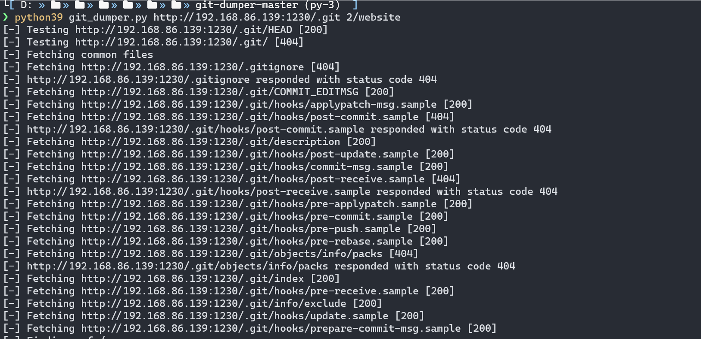
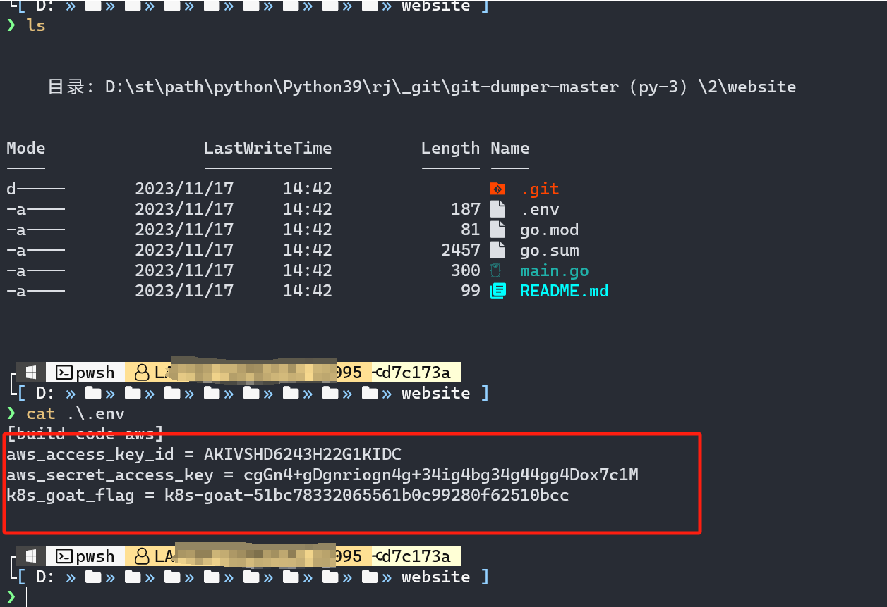

**Sensitive keys in codebases**

代码库中敏感信息

<http://192.168.86.139:1230/>

使用目录扫描工具进行扫描

直接发现是.get文件泄漏

使用git扫描工具下载文件

在下载目录使用git查看提交的Log日志

 

发现

 

切换分支：git checkout d7c173ad183c574109cd5c4c648ffe551755b576

成功读取到

 
