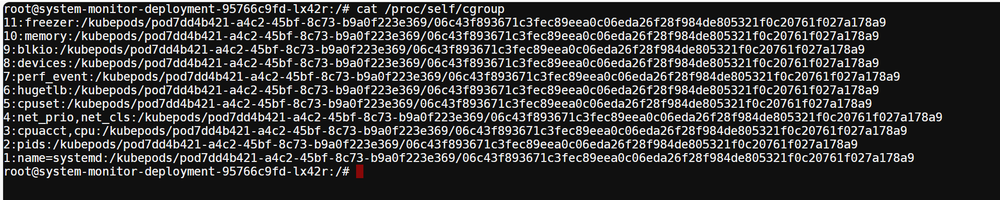
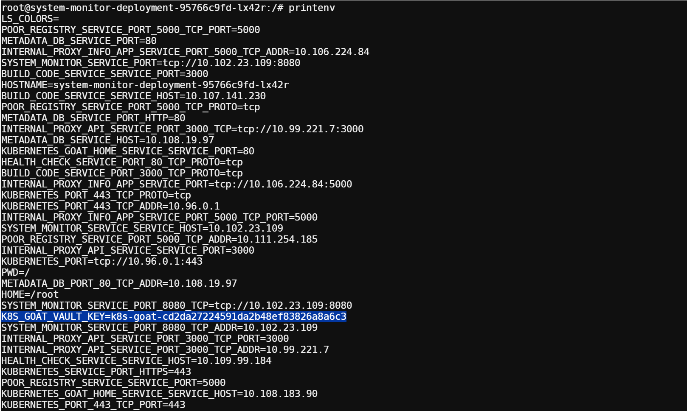

Gaining environment information

获取环境信息

这与传统工作负载没有什么不同。大多数计算实例在运行应用程序时都会在环境变量中存储机密、api_keys等敏感信息。同样，在 Kubernetes 中，大多数人将 Kubernetes Secrets 和 Config 值等敏感信息存储在环境变量中，如果攻击者能够发现 RCE（远程代码执行）或命令注入等应用程序漏洞，那么该秘密的游戏就结束了。

地址：[GoTTY - bash (system-monitor-deployment-95766c9fd-lx42r)](http://192.168.86.139:1233/)

 

1、在容器中得环境变量以及一些设置找到，可以找到api_keys等敏感信息

我们可以通过运行以下命令来获取容器运行时信息

cat /proc/self/cgroup

我们可以获取容器主机信息的信息

cat /etc/hosts

我们可以获取挂载信息

mount

我们可以访问环境变量，包括挂载的 Kubernetes 密钥和服务名称、端口等。

printenv

 

 

 

 

 

 

 

 
