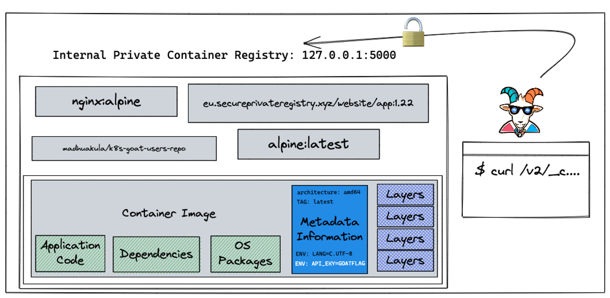
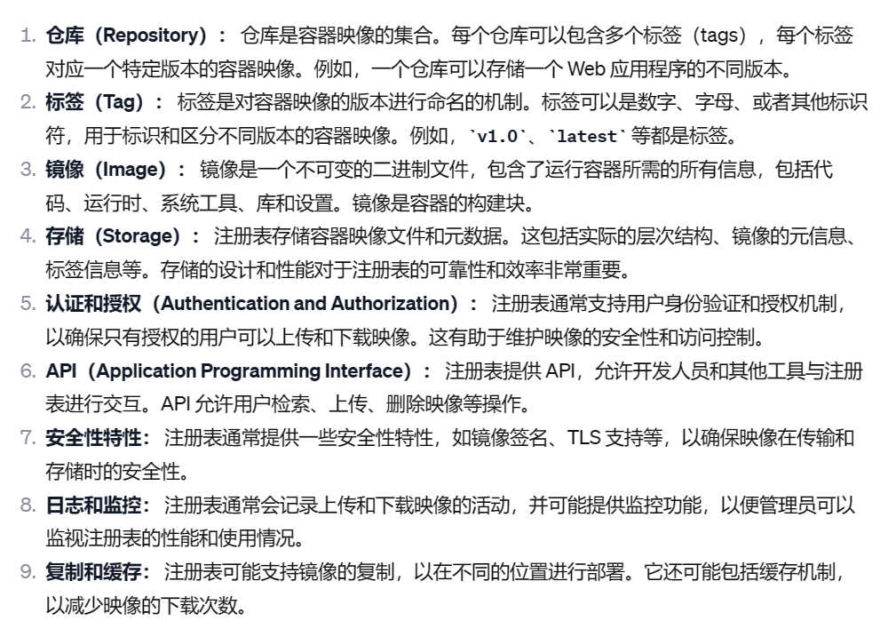
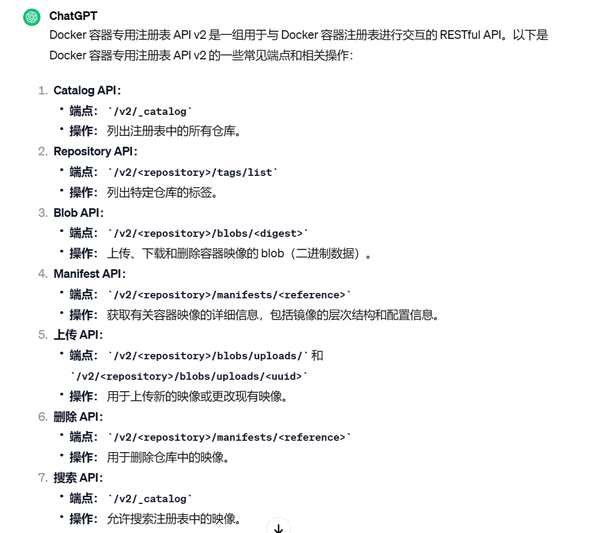
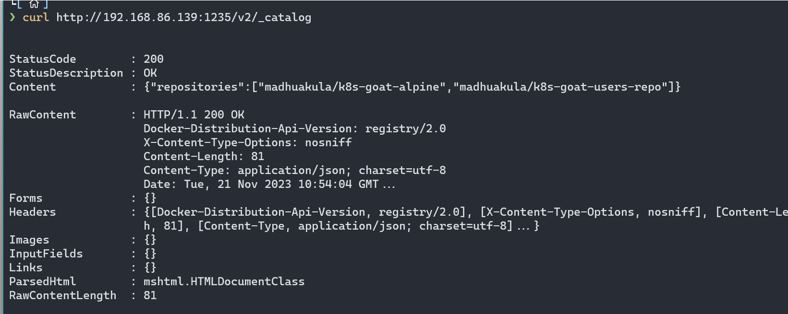
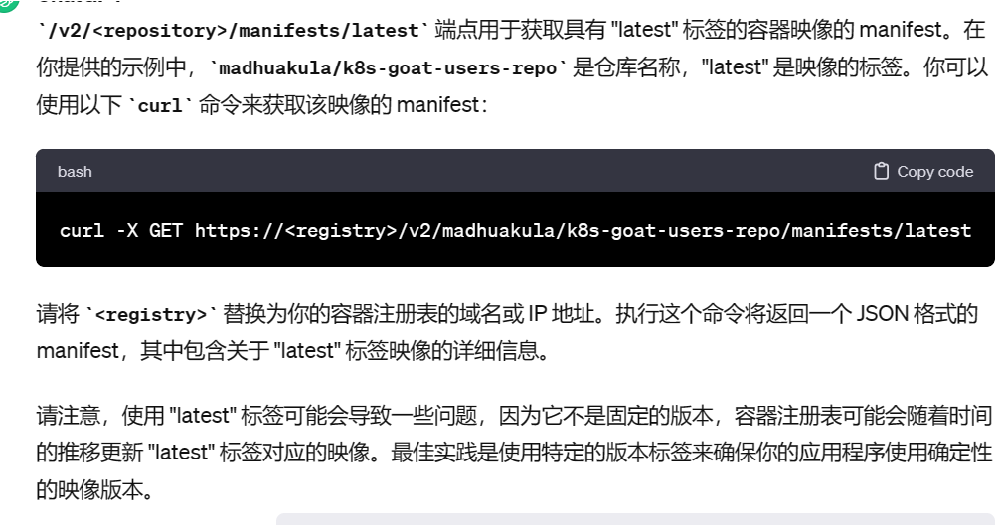
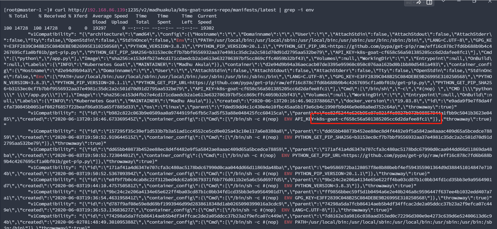

Attacking private registry

攻击私有注册表

在此方案中，我们将看到 Docker 容器专用注册表的错误配置之一，以及如何获取和访问映像及其内容。在容器的早期，有一个流行的黑客攻击，vine（现在收购的Twitter）被黑客入侵，由于这个简单的错误配置，产品的整个源代码被泄露了。此外，即使在今天，我们也看到大量类似的案例，但也有经过身份验证的注册表以及错误配置的权限和特权。\[管理员权限配置不当造成\]

 

地址：http://192.168.86.139:1235/

 

Docker 容器专用注册表的默认端口是5000

Docker 容器专用注册表一般包含

curl <http://192.168.86.139:1235/v2/madhuakula/k8s-goat-users-repo/manifests/latest> \| grep -i env

 

通过查询chatgpt发现，这个印象中可以查询到key，其中，我们可以通过这个api接口，上传一个映像到目标docker注册表中，这个时候，就等对方运维人员运行这个docker

也就是说，可以通过这个来上传一个镜像，进行权限维持操作

 

在 Docker 容器注册表 API v2 中进行映像上传涉及多个步骤。以下是一个基本的示例，假设你已经登录到注册表并获得了授权令牌（Bearer Token）：

1、开始上传（Initiate Upload）： 使用 /v2/\<repository\>/blobs/uploads/ 端点开始上传，并获取一个上传 URL。

> curl -X POST -H "Authorization: Bearer \<token\>"
>
> 这将返回一个包含上传 URL 的 JSON 对象。

2、上传映像数据： 使用获得的上传 URL，将映像数据（二进制 blob）通过 HTTP PUT 请求上传。

> curl -X PUT -H "Authorization: Bearer \<token\>" --data-binary "@\<image-file\>" \<upload-url\>
>
> 这里 \<image-file\> 是本地映像文件的路径

3、完成上传（Complete Upload）： 使用 /v2/\<repository\>/blobs/uploads/\<uuid\> 端点标记上传操作的完成。

> curl -X PATCH -H "Authorization: Bearer \<token\>" -H "Content-Type: application/json" --data '{"status": "uploaded"}' \<upload-url\>
>
> 或者，如果使用 "complete" 操作：
>
> curl -X POST -H "Authorization: Bearer \<token\>" -H "Content-Length: 0" \<upload-url\>

 

要通过 Docker 容器注册表 API v2 查看已上传的映像，你需要使用 /v2/\<repository\>/manifests/\<tag\> 端点来获取映像的元数据。以下是一个示例：

> curl -X GET -H "Authorization: Bearer \<token\>"
>
>  
>
> 在这个命令中，\<token\> 是你的身份验证令牌，\<registry\> 是注册表的地址，\<repository\> 是仓库名称，\<tag\> 是映像的标签。
>
> 响应将是一个 JSON 格式的映像元数据。你可以查看该元数据以获取关于映像的详细信息，包括每个层次结构的摘要、配置信息等。
>
>  

\[**但是我不知道为什么我本地测试失败**\]

>  
